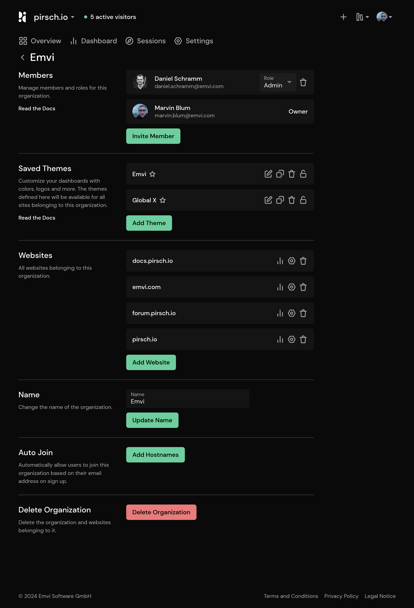

# Access and Permissions

There are several ways to manage access to your site statistics. They always refer to the currently active domain. For example, to give the same person access to two sites, you must add them to both separately.

## Public Access

The *Public Access* and *Access Links* sections both allow anyone to access your dashboard.

*Public Access* makes your dashboard available to anyone on the subdomain you chose when creating the website. An example of this is our live demo on [pirsch.pirsch.io](https://pirsch.pirsch.io/), where the first *pirsch* in the domain is replaced by the one you configured.

*Access Links* can be used to generate a link that allows anyone who has it to read your dashboard. The advantage over *Public Access* is that you can delete links to deny access without disrupting anyone who has another link.

## Private Access

If you don't want to send out links or make your dashboard public to anyone, you can invite members instead. Click *Invite Member* to add new members to your website and enter all email addresses you would like to invite. The invited members will have to create an account for Pirsch if they don't already have one and accept the invitation.

After the members joined, they will be able to view all statistics without modifing settings. You can change the member role to give them administrative access to your dashboard, including:

* Managing members (not including themselves or you, the owner)
* Managing access links
* Resetting the identification code
* Managing clients

To remove a member, just click on the trash icon.

## Organizations

::: info
Organizations are a Pirsch Plus feature.
:::

Organizations allow you to group dashboards, provide access to team members and customers, and apply [themes](/advanced/theme).

They can be accessed from the user menu in the top right corner.

Each member has a role, which can be either Owner (you), Administrator, or Viewer. The Owner requires an active subscription. Administrators can add sites and manage settings on your behalf. They can use themes assigned to the organization. Viewers have read access to all sites belonging to the organization and are useful if you have clients with multiple sites, for example.

Organization are **not** white-labeled. Unlike invitations to dashboards, members must have an account on Pirsch. Only direct invitations to dashboards are themed and will use the custom domain if configured.

### When to Use an Organization

You can use an organization to manage your dashboards in the following cases:

* Team members need to be able to create dashboards on your behalf and add them to your subscription. Only sites that belong to an account with an active subscription will be tracked, and your team members don't need individual subscriptions.
* Resell our service to your clients and give them access to one or more dashboards
* You want to share a base theme with all your clients
* Eliminate the need to assign team members to each dashboard individually

### Overwrite Settings

It's possible to override organizational settings. For example, if a team member who is added to a dashboard is also added to the organization to which the dashboard belongs, the dashboard permissions will override the organization settings.

You can also override the basic theme settings on the [themes settings page](/advanced/theme).
