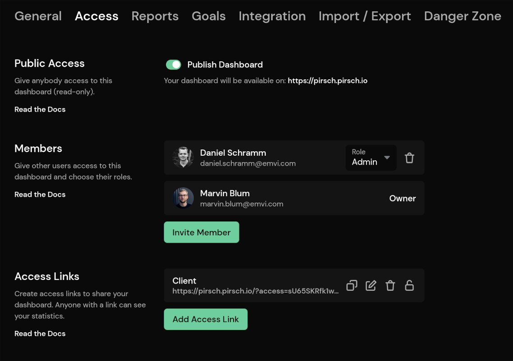

# Access and Permissions

There are multiple ways to manage access to your websites statistics. They always refer to the currently active domain. To give the same person access to two websites for example, you need to add them to both separately.

### Public Access

The *Public Access* and *Access Links* section both give anyone access to your dashboard.

*Public Access* will make your dashboard public to anyone on the subdomain you have chosen when creating the website. An example for this is our live demo on [pirsch.pirsch.io](https://pirsch.pirsch.io/), where the first *pirsch* in the domain is replaced by the one you have configured.

*Access Links* can be used to generate a link which allows anyone who has it to read your dashboard. The advantage over the *Public Access* is that you can delete links to deny access, without interrupting anyone who has a different link.

### Private Access

If you don't want to send out links or make your dashboard public to anyone, you can invite members instead. Click *Invite Member* to add new members to your website and enter all email addresses you would like to invite. The invited members will have to create an account for Pirsch if they don't already have one and accept the invitation.

After the members have joined, they will be able to view all statistics without modifing settings. You can change the member role to give them administrative access to your dashboard, including:

* managing members (not including themselves or you, the owner)
* managing access links
* resetting the identification code
* managing clients

To remove a member, just click on the trash icon.

