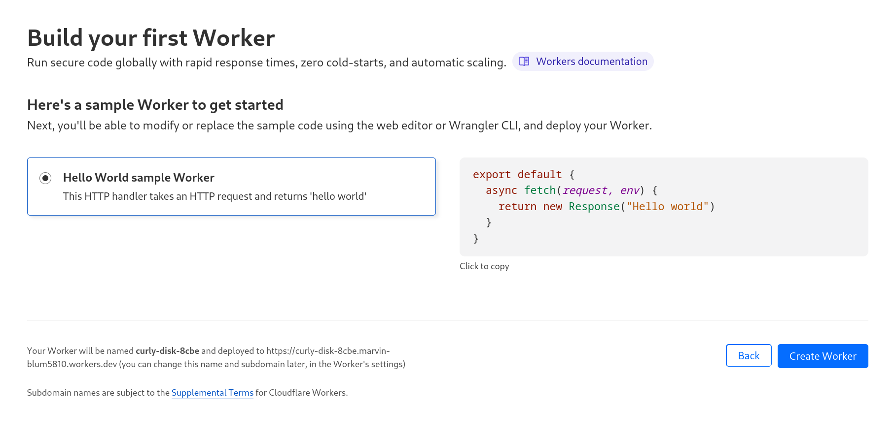
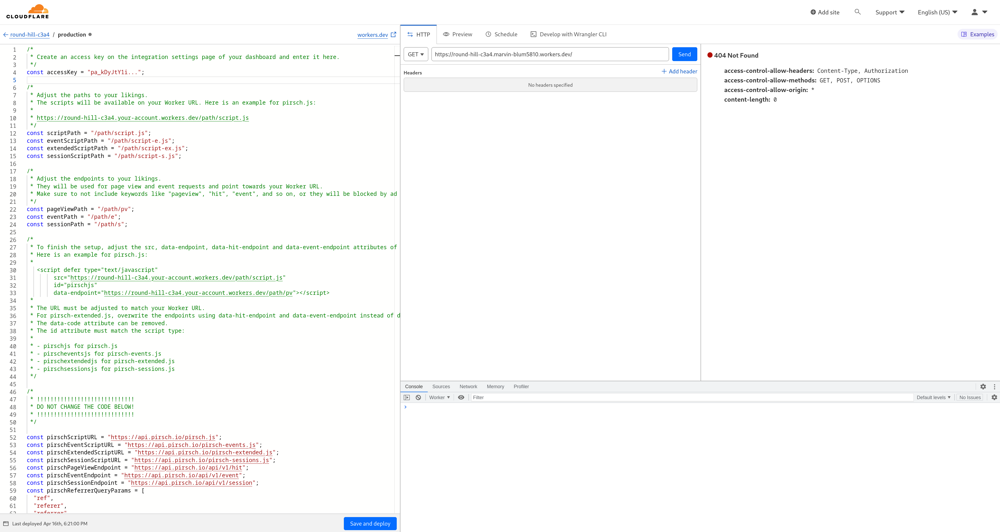
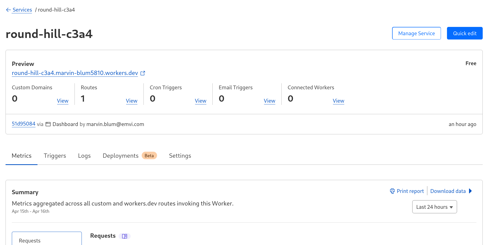
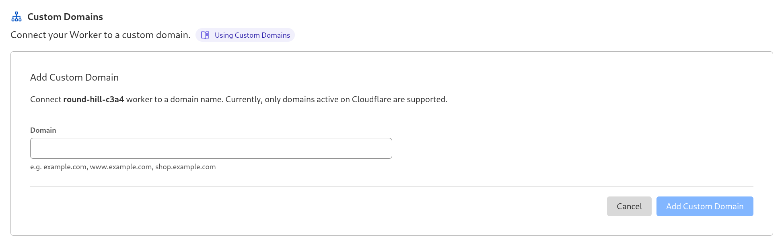

# Proxying Pirsch Analytics Through Cloudflare Workers

[Cloudflare Workers](https://workers.cloudflare.com/) can be used to proxy the Pirsch Analytics scripts. They are free for up to 100,000 requests a day. All you need is a free Cloudflare account.

The benefits of using a proxy are described [here](../get-started/proxy).

For rewrites/redirects of the scripts, read [this](/faq#can-i-use-vercel-rewrites-redirects-to-proxy-the-scripts).

## Creating an Access Key

Before we get into the Cloudflare setup, navigate to the integration settings page of your dashboard and create a new client by clicking **Add Client**. The type must be **Access Key**. Give it a name and click **Create Client**. Copy the access key and save it for later. It looks something like this: `pa_x93ko...`.

## Creating the Worker

Using the access key from the previous step, we can now set up the proxy on Cloudflare. Create a free account at [Cloudflare](https://cloudflare.com/) and click **Workers** in the sidebar. Select the **Hello World** example and click **Create Worker**.



Creating the worker will take you to the editor. Remove the example code from the code view on the left and paste the [code from GitHub](https://raw.githubusercontent.com/pirsch-analytics/demo/master/cloudflare-workers/worker.js).

::: info
The worker code is only available on GitHub to keep the instructions as short as possible.

[Get the code](https://raw.githubusercontent.com/pirsch-analytics/demo/master/cloudflare-workers/worker.js)
:::



Next, paste the access key from the previous step inside the `accessKey` constant so that it looks something like this.

```js
const accessKey = "pa_x93ko...";
```

Adjust the script and endpoint paths to your liking. These will later be used to integrate the snippet on your page and shouldn't contain any keywords blocked by ad blockers, like *tracker*, *event*, or *hit*.

Here is an example of how you could change them.

```js
const scriptPath = "/static/files/p.js";
const eventScriptPath = "/static/files/ev.js";
const extendedScriptPath = "/static/files/ext.js";
const sessionScriptPath = "/static/files/ses.js";

const pageViewPath = "/p/pv";
const eventPath = "/p/e";
const sessionPath = "/p/s";
```

In this case, the JavaScript files (like `pirsch.js`) will be served from the `/static/files` directory, while the page view, event, and session requests will be sent to `/p/pv`, `/p/e`, and `/p/s`.

You can also adjust the `Access-Control-Allow-Origin` if you like. Usually, allowing all sources `*` is good enough.

```js
// Allow just a specific domain.
const accessControlAllowOrigin = "your-domain.com";

// Allow all sources.
const accessControlAllowOrigin = "*";
```

After making your adjustments, save the worker by clicking **Save and deploy**. Your worker is now ready to be used.

## Adding the JavaScript Snippet

The last step is to add the JavaScript snippet to your site. In case you've already added Pirsch to your site, you can replace the snippet. The examples below use the paths defined above.

Note that you need to use the URL of your worker and make sure that the id attribute is set correctly.

```html
<!-- The new pirsch.js uses p.js and you'll have to add the data-endpoint attribute. -->
<script defer type="text/javascript"
    src="https://round-hill-c3a4.your-account.workers.dev/static/files/p.js"
    id="pirschjs"
    data-endpoint="https://round-hill-c3a4.your-account.workers.dev/p/pv"></script>

<!-- The new pirsch-events.js uses ev.js and you'll have to add the data-endpoint attribute. -->
<script defer type="text/javascript"
    src="https://round-hill-c3a4.your-account.workers.dev/static/files/ev.js"
    id="pirscheventsjs"
    data-endpoint="https://round-hill-c3a4.your-account.workers.dev/p/e"></script>

<!-- The new pirsch-sessions.js uses ses.js and you'll have to add the data-endpoint attribute. -->
<script defer type="text/javascript"
    src="https://round-hill-c3a4.your-account.workers.dev/static/files/ses.js"
    id="pirschsessionsjs"
    data-endpoint="https://round-hill-c3a4.your-account.workers.dev/p/s"></script>

<!-- The new pirsch-extended.js uses ext.js and you'll have to add the data-hit-endpoint and data-event-endpoint attributes. -->
<script defer type="text/javascript"
    src="https://round-hill-c3a4.your-account.workers.dev/static/files/ext.js"
    id="pirschextendedjs"
    data-hit-endpoint="https://round-hill-c3a4.your-account.workers.dev/p/pv"
    data-event-endpoint="https://round-hill-c3a4.your-account.workers.dev/p/e"></script>
```

Of course, you can still use the other options available when adding the snippet, like excluding and including pages.

## (Optional) Changing the Worker URL

You can modify the URL of your worker if you want. By default, they look somewhat ugly and confusing. You can change that on the workers quick edit page.



Under the **Triggers** tab, you can either define a custom domain or change the route.




If you changed the route to your own domain, you can update the scripts and make the paths relative, like this.

```html
<script defer type="text/javascript"
    src="/static/files/ext.js"
    id="pirschextendedjs"
    data-hit-endpoint="/p/pv"
    data-event-endpoint="/p/e"></script>
```
