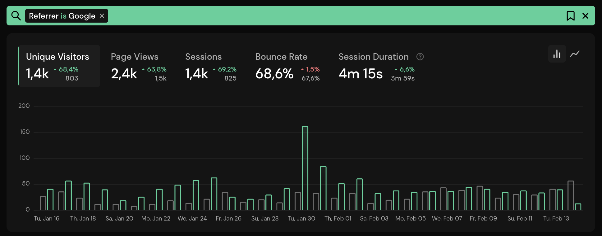

# Comparing Statistics

Comparing statistics over time provides valuable insights. We made it easy by offering a comparison view that lets you quickly analyze statistics from two different time periods on the dashboard.

## Comparing Two Periods

To compare periods, first select the current period you want to view from the date selection drop-down list. You can also use the keyboard shortcuts (to the right of the period) to select a period, or use the arrow keys and press Enter. In the screenshot below, it's set to the last 30 days.

Next, select the period you want to compare to from the comparison drop-down list next to the primary period. You can choose between

* Previous Period: This will compare the statistics right to the previous period. For example, if you set the primary period to the last 30 days, this will select the last 30 days before that period.
* Year Over Year: compares the statistics to the same period in the previous year
* Custom Period: allows you to select dates. These must be set to dates that start before the primary period.

You also have the option to compare the day of the week, which is set to **on** by default. This ensures that days are compared to their previous weekday. If you turn it off, only the dates are considered, ignoring the weekday compared in the graph. If it is on and a single day is being compared, it will be compared to the same **day of the week** before. Otherwise it will compare it to **yesterday**.

After enabling the comparison view, the graphs will update to show the data for the previous period. The growth in the chart selection (**Unique Visitors**, **Page Views**, etc.) shows how much the traffic has increased or decreased compared to the selected previous period. The total for the previous period is also displayed in light gray.

Note that you can also toggle between a bar chart and a line chart. Hovering over a date in the graph will show the numbers for the current and previous periods and the dates compared.

## Selecting an Interval

You can select a different interval from the date selection drop-down list. For example, setting it to **week** will compare weeks instead of single days. This can also be used to compare months and years. The available intervals depend on the selected time period.

## Filtering and Segmentation

It's possible to compare filtered statistics. If you add a filter, it will also be applied to the previous period. Here is an example showing only page views with **Google** set as referer.

To add a filter, simply click on an entry in the dashboard or select one from the filter drop-down using the lens icon in the top right corner.
