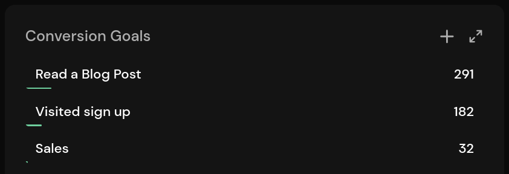
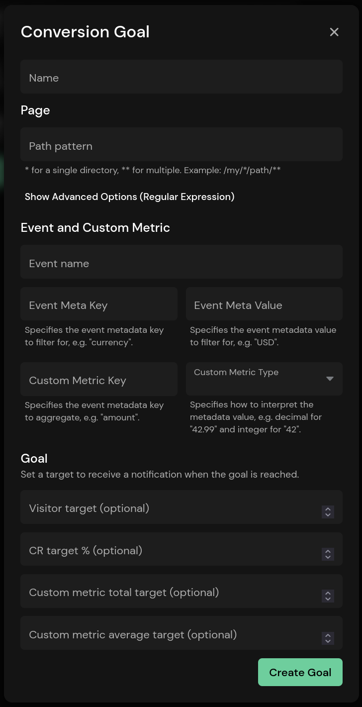
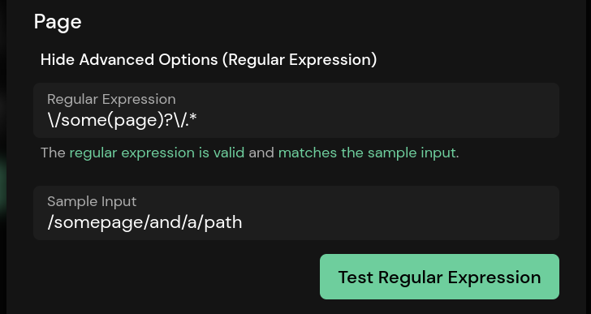
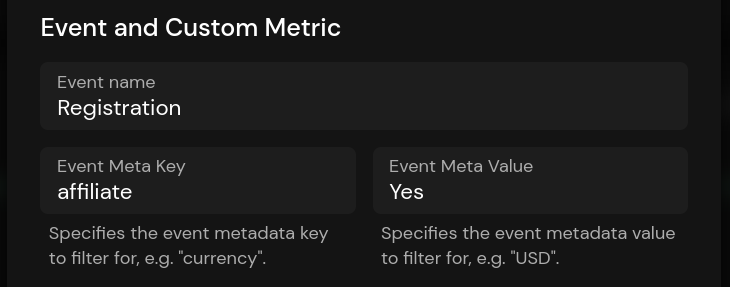
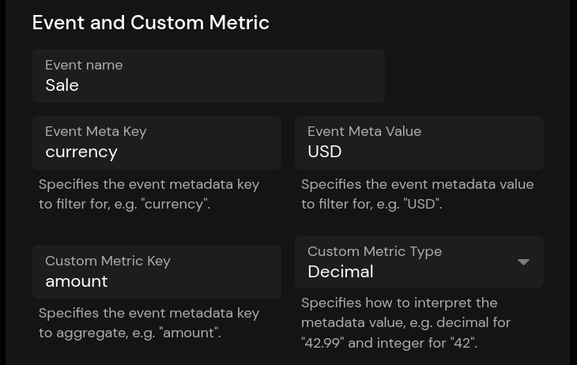
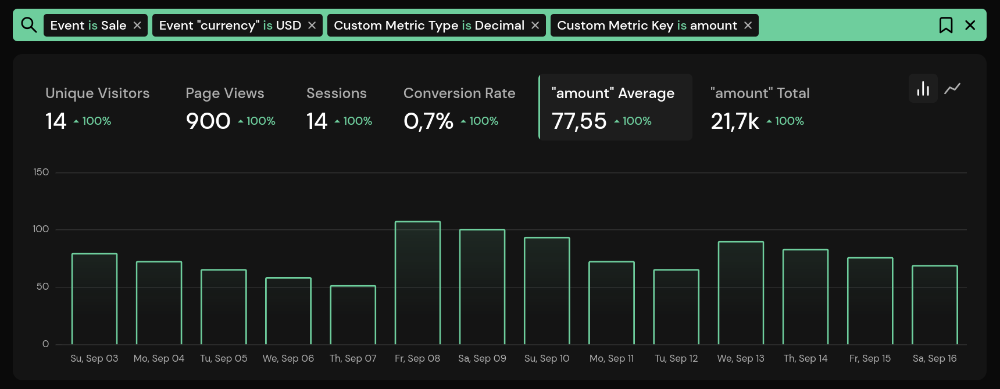

# Tracking Conversion Goals and Custom Metrics

Conversion goals allow you to track statistics and the conversion rate for pages or groups of pages, events, and custom metrics. A goal is an action you would like your visitors to make, such as clicking on a specific site, reading blog posts, or doing a purchase.

After creating a conversion goal, it will be displayed on the dashboard in the **Conversion Goals** panel. You can expand the panel in the top-right corner to get more insights or click an entry to filter the whole dashboard for it.



## Creating Conversion Goals

To create a new goal, click the plus icon in the top-right corner. You can also manage goals on the conversion goals settings page (**Settings** > **Goals**).



The name is used to identify the goal on the dashboard and must be set. A goal must either have a path pattern, an event, or both.

### Tracking Path Patterns

The pattern is used to filter for a single page or a group of pages. You can use single or double asterisks as wildcards for parts of the path. A single asterisk is used as a wildcard for a single part of the path. It matches anything that is not a forward slash (with a length of zero or more). Double asterisks are used to match multiple parts of the path, including slashes (with a length of zero or more). Here are a few examples:

| Pattern | Description |
| - | - |
| `/` | Exact match. |
| `/home` | Exact match. |
| `/**` | Matches all paths. |
| `/blog/*` | Matches the pages below `/blog`, like `/blog/article`, but not `/blog/article/first`. |
| `/blog/**` | Matches all pages below `/blog`, like `/blog/article` and `/blog/article/first`. |
| `/blog/*/first` | Matches all pages below `/blog` that end with `/first` with one part in between, like `/blog/article/first`, but not `/blog/page/first` or `/blog/some/page/first`. |
| `/blog/**/first` | Matches all pages below `/blog` that end with `/first` with one or more parts in between, like `/blog/article/first` or `/blog/some/page/first`, but not `/blog/some/page/second`. |

Using the advanced options allow you to define a custom regular expression and test it. You can use a tool like [regex101.com](https://regex101.com/) to test multiple paths instead of using the build-in field.



### Tracking Events

Conversion goals can be used to filter for an [event](/advanced/events) with a metadata key and value. Events are triggered programmatically, so you control when an event is sent and what's stored in the metadata.

Note that you do not need to create a conversion goal to track events, as they are also displayed in a separate panel. Conversion goals with events become useful when used in conjunction with custom metrics and an event metadata key and value.

Here is an example of a conversion goal that tracks all registrations that come from an affiliate link.



Clicking on the conversion goal will filter the dashboard for the *Registration* event and the *affiliate=Yes* metadata. You can also add a path pattern to filter for events triggered on a specific page or group of pages.

## Tracking Custom Metrics

::: info
Custom metrics are a Pirsch Plus feature.
:::

Custom metrics help you track the total and average for a metadata field. This can be anything, such as e-commerce revenue, time spent reading blog posts, time spent scrolling, ...

To add a custom metric, make sure your events contain the metadata field you want to track and are either integer (whole number) or decimal (floating point). Here is an example of an event that fires every time a visitor places an order. Note that we are tracking the currency and the amount.

```js
pirsch("Sale", {
    meta: {
        currency: "USD",
        amount: 99.42
    }
});
```

Now, to track sales, add a custom metric to your conversion goal.



As you can see, we're filtering for the *Sale* event and the currency. The type is set to decimal because we use decimal places for the *amount*.

Filtering for the conversion goal on the dashboard will show two new graphs: the amount average and the total.



The graphs show the average purchase amount and total revenue over time. Of course, you could use a different metric, so how you interpret the graphs depends on your use case.

### Receive a Notification When the Goal Is Reached

The visitor, CR, custom metric total, and custom metric average targets are optional. If you leave them empty, the goal will measure the number of visitors and conversion rate indefinitely. To automatically delete the goal and receive a notification once it's reached, toggle the two checkboxes that will appear when you set one of the fields. If you don't automatically delete the goal, the notification will only be sent once, but you can reactivate it by editing the goal and selecting the checkbox again.
