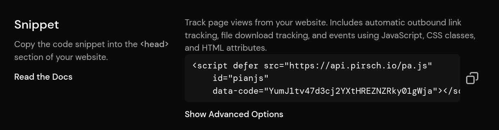

# Custom Domains

::: info
Custom domains are a Pirsch Plus feature.
:::

The dashboard and scripts can be served from your own domain. Combined with [themes](/advanced/theme) allowing you to fully white label Pirsch.

## Configuring up a Custom Domain

Custom domains can be configured on the **General** settings page of your dashboard. You will need an **unused** domain to serve the dashboard and scripts. This can be a subdomain like `dashboard.custom-domain.com` or any other unused top level/subdomain you have. **You must use a separate domain for each dashboard. Using a single domain to host multiple dashboards, as we do on dashboard.pirsch.io, is not currently supported.**.


After entering your domain, click **Save** and copy the DNS records that appear below. Create four new records for your domain.

* Two A records with your domain and the IPv4 addresses (one for each)
* Two AAAA records with your domain and the IPv6 addresses (one for each)

If you are using a subdomain, be sure to specify it as the host. Otherwise, use `@` for the root domain (or leave it blank). The exact way you need to configure DNS depends on your domain provider. Here is a [zone file](https://en.wikipedia.org/wiki/Zone_file) for `my.custom-domain.com`.

```
$ORIGIN custom-domain.com.
$TTL 3600
my IN A 49.12.191.129
   IN A 159.69.94.230
   IN AAAA 2a01:4f8:c012:cb50::1
   IN AAAA 2a01:4f8:1c1b:cb09::1
```

And here is one for the top level domain `custom-domain.com`:

```
$ORIGIN custom-domain.com.
$TTL 3600
@ IN A 49.12.191.129
  IN A 159.69.94.230
  IN AAAA 2a01:4f8:c012:cb50::1
  IN AAAA 2a01:4f8:1c1b:cb09::1
```

After you add the records, make sure they are propagated. You can do this by entering your domain or subdomain into a tool such as [DNS Checker](https://dnschecker.org/).

## SSL

We automatically request an SSL certificate for your domain the first time you visit. So the first time you open the dashboard on your own domain, it may take a while for it to load. Once the certificate is obtained, we'll automatically update it as needed.

## Serving Scripts on Your Own Domain

If you have configured a custom domain, the script snippet on the **Integration** settings page will use your domain.



The snippet can now be served from your own domain. Replace `api.pirsch.io` with your own domain in the `src` attribute.

Additionally, the script now uses different endpoints (`data-hit-endpoint`, `data-event-endpoint`, `data-session-endpoint`) so that requests aren't made directly to `pirsch.io`.

The regular snippet without the custom domain will still work. However, to use your custom domain, replace your existing snippet integration with the updated one.
