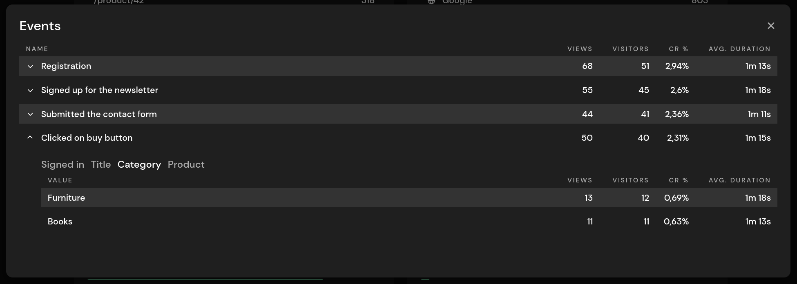

# Events

Events measure how many visitors took a particular action, such as clicking a button or filling out a form, and calculate the conversion rate and (optional) average time. You can filter the dashboard by events and track additional metadata fields (key-value pairs).

The main difference from [conversion goals](/advanced/conversion-goals) is that you can programmatically control when an event is sent and attach metadata.

::: info
Events count towards your billable monthly page views.
:::

::: danger
You must ensure that no [Personally Identifiable Information (PII)](https://en.wikipedia.org/wiki/Personal_data) is sent within a metadata field. All other information is anonymized, as is the case for hits. PII includes any information that can be used to uniquely identify an individual, such as a full name, email address, phone or credit card number, IP address, etc.
:::

## Creating Events

Events are automatically created and added to your dashboard when you send them. Events can be sent from your website using JavaScript, or from your backend using our [API](/api-sdks/api) or one of our [SDKs](/api-sdks/sdks).

## Sending Events From Your Website

Before you can send your first event, you need to add the JavaScript snippet to your website. It's different from the normal `pirsch.js` to reduce page load and keep the script lightweight. Navigate to the Settings page on the dashboard and select the **Goals and Events** tab. Copy the code snippet for your domain and add it to the `head` section of each page you want to send events from. The snippet looks like this:

```HTML
<script defer type="text/javascript" src="https://api.pirsch.io/pirsch-events.js"
    id="pirscheventsjs"
    data-code="5gXQXdNTvteM4eVY35fNBkcU5CbStFSq"></script>
```

The `data-code` is the identification code for your domain. If you reset it (under the **Developer** tab), you will also need to replace it in the snippet.

The `data-exclude` attribute used in the regular `pirsch.js` can also be used for the event snippet. See [frontend integration](/get-started/frontend-integration) for details.

::: info
The snippet **can't** be used as a replacement for the regular `pirsch.js`, which needs to be added to send page views. `pirsch-events.js` can only be used to send events programmatically. If you want to do both, add both snippets to the `head` section of your website.
:::

### Example 1

You are now ready to start sending events. Here is a simple example of how to send an event at the click of a button.

```HTML
<button id="button">Send Event</button>

<script type="text/javascript">
    // Wait until the page has finished loading before adding the event listener.
    document.addEventListener("DOMContentLoaded", () => {
        let clicks = 1;

        // You might need to use a different selector, like if you have other elements in your button.
        // See the second example on how you could solve that.
        document.getElementById("button").addEventListener("click", () => {
            pirsch("Button Clicked", {
                duration: 42,
                meta: {
                    Clicks: clicks
                }
            }).then(() => {
                clicks++;
            }).catch(e => {
                console.error(e); // log the error but still count up
                clicks++;
            });
        });
    });
</script>
```

The script sends an event on every button click and adds one to the counter. The important part here is the call to the `pirsch` function. The first parameter is the event name, followed by optional parameters. The `duration` parameter can be used to send a number (seconds) with the event, which is used to calculate the average duration. This can be the time spent on the page, for example, or anything you want, such as the time it took to read a blog post. The 'meta' parameter is an object containing key-value pairs and is displayed below the event on the dashboard. The attached metadata can be used later to further break down the event. Note that you can only use scalar values (strings, numbers and booleans). There is no limit to the number of metadata fields you can send.

The function returns a promise, which you can use to continue with your code after the event has been sent, or to handle any errors. We recommend that you perform your action even if the event cannot be sent, to avoid any interruption.

### Example 2

Here is an example of how to send an event when an external link is clicked. The custom attribute `pirsch-link` is used to query the links that should generate an event and is also used as the event name.

```HTML
<a href="https://external-page.com/"
   target="_blank"
   pirsch-link="Link Clicked">
    Visit external <span>page</span>
</a>

<script type="text/javascript">
    // Wait until the page has finished loading before adding the event listener.
    document.addEventListener("DOMContentLoaded", () => {
        // Select all elements with the "pirsch-link" attribute.
        const links = document.querySelectorAll("[pirsch-link]");
        
        // Add an event listener to each link to send an event on click.
        links.forEach(link => link.addEventListener("click", e => {
            // Find clicked element.
            let target = e.target;

            while(!target.hasAttribute("pirsch-link")) {
                target = target.parentNode;
            }

            // Use the attribute as the event name.
            const eventName = target.getAttribute("pirsch-link");
            pirsch(eventName);
            console.log("Pirsch event sent", eventName); // optional to see if it is working
        }));
    });
</script>
```

The span inside the HTML code is only there to demonstrate how you can get the actual element that was clicked if it contains child elements. You can skip this step for links that contain text only.

### Testing

On `localhost` events are ignored and the event details are printed to the console instead. You can open the browser console to confirm that an event is being sent in production. The output should look something like this

```
Pirsch event: Button Clicked {"duration":42,"meta":{"Clicks":1}}
```

## Sending Events From Your Backend

Sending an event from your backend works just like submitting a hit, except that you also append the event name, duration and metadata fields. Before you can use the backend integration, make sure you have [created a client](/get-started/backend-integration#create-a-client). You can then use this client to [send an event](/api-sdks/api#sending-an-event).

## Dashboard and Filtering

Events are listed in their own panel on the dashboard. The panel is available if you have sent at least one event within the selected time period. It shows the number of unique visitors and the conversion rate, and can be expanded to show more details. You can click on an event to filter for it.


The detailed view shows the event name, the number of views, the number of unique visitors, the conversion rate, and the average duration.



To filter for an event, click on one of the entries in the Panel or Detail view. It will be added to the list of filters. Here is an example for all visitors who have subscribed to the newsletter. Panels that are not relevant to events (such as number of sessions, average time on page, etc.) will be hidden.


