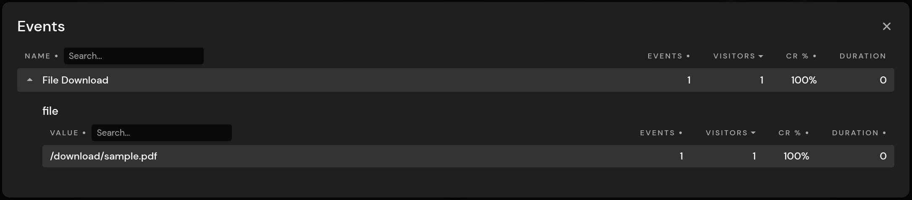
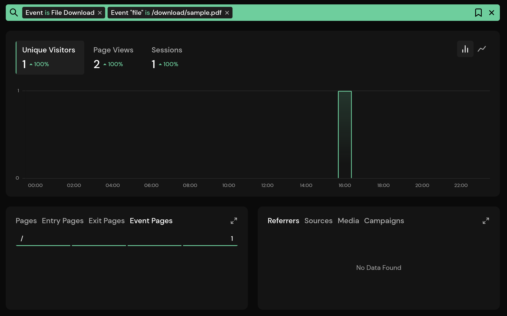

# Tracking File Downloads

Tracking file downloads is a common task for site owners. It lets you know how often a file was downloaded, which page the download was made on, and filter your dashboard accordingly. Pirsch allows you to automate this task by placing a JavaScript snippet on your website.

::: info
Tracking file downloads count towards your billable monthly page views.
:::

## Adding Tracking to File Downloads

Tracking file downloads requires adding the `pirsch-extended.js` script to your website. If you have the regular `pirsch.js` and/or `pirsch-events.js` scripts installed, tracking page views and events, you need to replace them with the extended script. The extended script combines the functionality of the other scripts, including tracking [outbound links](/advanced/outbound-links) and [404 error pages](/advanced/not-found-tracking).

Navigate to the settings page on the dashboard and select the **Integration** tab. Copy the code snippet for your domain and add it to the `head` section of each page you want to track file downloads on. Here is a simple example on what it will look like. You can use the advanced options on the settings page to customize the snippet.

```html
<script defer src="https://api.pirsch.io/pirsch-extended.js"
    id="pirschextendedjs"
    data-code="zddEQ4e6QGDno9GCe6dofGgWARPEyJWt"></script>
```

The script will also track outbound links by default. If you don't want this behaviour, you can disable it by adding the `data-disable-outbound-links` parameter.

A lot of file formats will be tracked by default, but you can extend it by adding the `data-download-extensions` parameter. Here is an example on how you would add `.tar` and `.ttf` files.

```html
<script defer src="https://api.pirsch.io/pirsch-extended.js"
    id="pirschextendedjs"
    data-code="zddEQ4e6QGDno9GCe6dofGgWARPEyJWt"
    data-download-extensions="tar,ttf"></script>
```

Note that they are separated using a comma and do not include the first dot.

## Analyzing File Downloads on Your Dashboard

File downloads will be tracked as events on your dashboard. By default, they will be displayed as **File Download**, but you can change that by setting the `data-download-event-name` parameter. Expanding the event will reveal the files that have been downloaded by your visitors.



Click an entry in the details view to filter the dashboard. The **Event Pages** panel lists all pages the file has been downloaded on.



## Ignoring File Downloads

You can ignore individual file downloads by setting either the `pirsch-ignore` HTML parameter or `pirsch-ignore` CSS class. Clicking the links below won't trigger a file download event.

```html
<a href="https://yourdomain.com/example.pdf" pirsch-ignore>Outbound Links</a>
<a href="https://yourdomain.com/example.pdf" class="pirsch-ignore">Outbound Links</a>
```
