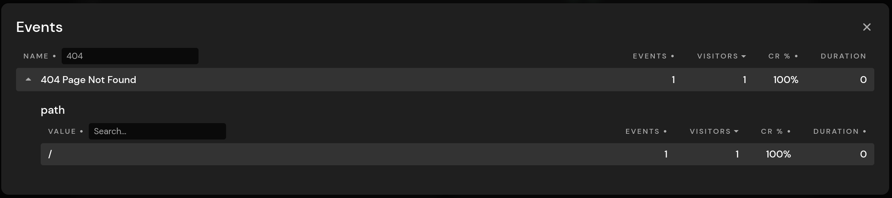
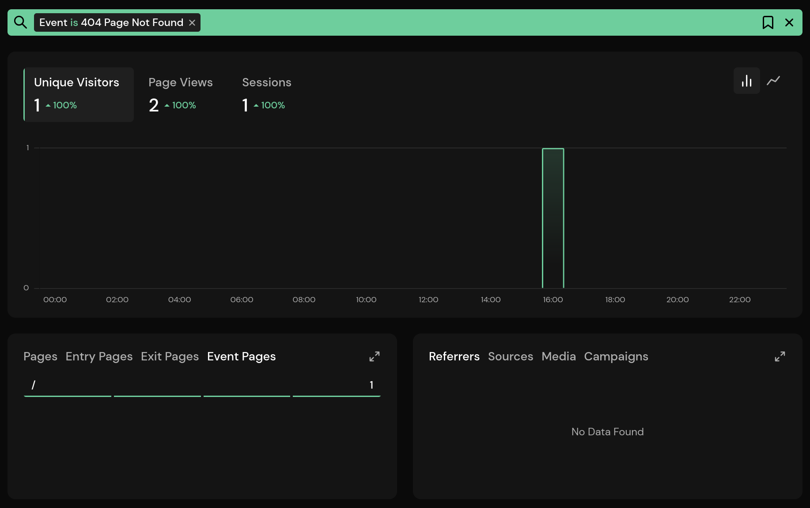

# Tracking 404 Not Found Error Pages

Tracking 404 error pages is a common task for site owners. It lets you know how often visitors land on a pages that doesn't exist, the path of the pages, and filter your dashboard accordingly. Pirsch allows you to automate this task by placing a JavaScript snippet on your website.

::: info
Tracking 404 error pages count towards your billable monthly page views.
:::

## Adding Tracking to 404 Error Pages

Tracking 404 error pages requires adding the `pirsch-extended.js` script to your website. If you have the regular `pirsch.js` and/or `pirsch-events.js` scripts installed, tracking page views and events, you need to replace them with the extended script. The extended script combines the functionality of the other scripts, including tracking [outbound links](/advanced/outbind-links) and [file downloads](/advanced/file-downloads).

Navigate to the settings page on the dashboard and select the **Integration** tab. Copy the code snippet for your domain and add it to the `head` section of each page you want to track file downloads on. Here is a simple example on what it will look like. You can use the advanced options on the settings page to customize the snippet.

```html
<script defer type="text/javascript" src="https://api.pirsch.io/pirsch-extended.js"
    id="pirschextendedjs"
    data-code="zddEQ4e6QGDno9GCe6dofGgWARPEyJWt"></script>
```

The script will also track outbound links and file downloads by default. If you don't want this behaviour, you can disable it by adding the `data-disable-outbound-links` and `data-disable-downloads` parameters.

After you have added the script, trigger the 404 error event. You need to do this on each 404 error page. There is no way for the script to figure out if the content was found or not. You can add the trigger from your server, or just statically place it on the site, if you redirect if a page is not found. Place the following script somewhere in the `<body>` tag of your HTML.

```html
<script type="text/javascript">
    document.addEventListener("DOMContentLoaded", () => pirschNotFound());
</script>
```

## Analyzing 404 Error Pages on Your Dashboard

404 error pages will be tracked as events on your dashboard. By default, they will be displayed as **404 Page Not Found**, but you can change that by setting the `data-not-found-event-name` parameter. Expanding the event will reveal the pages that couldn't be found.



Click an entry in the details view to filter the dashboard. The **Event Pages** panel lists all pages the file has been downloaded on.


