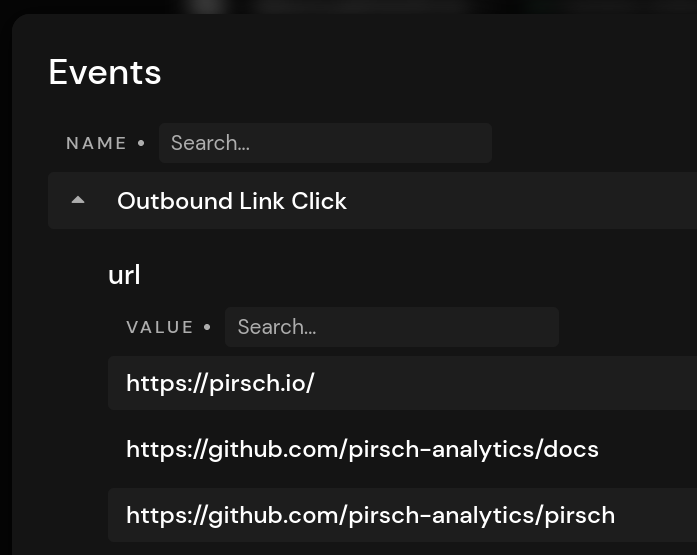
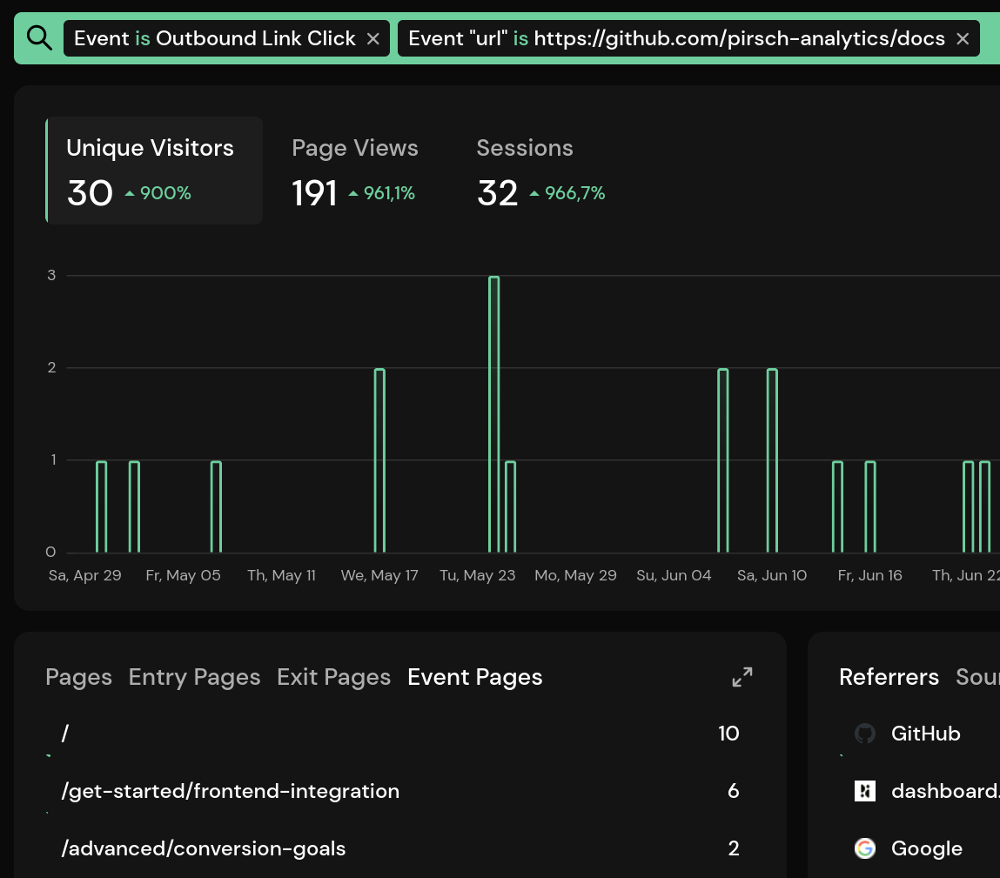

# Outbound Link Tracking

Tracking outbound links is a common task for site owners. It lets you know how often an external URL was clicked, which page the clicks occured on, and filter your dashboard accordingly. Pirsch allows you to automate this task by placing a JavaScript snippet on your website.

::: info
Tracking outbound link clicks count towards your billable monthly page views.
:::

## Adding Outbound Link Tracking

Tracking outbound link clicks requires adding the `pirsch-extended.js` script to your website. If you have the regular `pirsch.js` and/or `pirsch-events.js` scripts installed, tracking page views and events, you need to replace them with the extended script. The extended script combines the functionality of the other scripts, including tracking [file downloads](/advanced/file-downloads) and [404 error pages](/advanced/not-found-tracking).

Navigate to the settings page on the dashboard and select the **Integration** tab. Copy the code snippet for your domain and add it to the `head` section of each page you want to track outbound links on. Here is a simple example on what it will look like. You can use the advanced options on the settings page to customize the snippet.

```html
<script defer type="text/javascript" src="https://api.pirsch.io/pirsch-extended.js"
    id="pirschextendedjs"
    data-code="zddEQ4e6QGDno9GCe6dofGgWARPEyJWt"></script>
```

The script will also track file downloads by default. If you don't want this behaviour, you can disable it by adding the `data-disable-downloads` parameter.

## Analyzing Outbound Link Clicks on Your Dashboard

External link clicks will be tracked as events on your dashboard. By default, they will be displayed as **Outbound Link Click**, but you can change that by setting the `data-outbound-link-event-name` parameter. Expanding the event will reveal the external links that have been clicked by your visitors.



Click an entry in the details view to filter the dashboard. The **Event Pages** panel lists all pages the link has been clicked on.



## Ignoring Links

You can ignore individual links by setting either the `pirsch-ignore` HTML parameter or `pirsch-ignore` CSS class. Clicking the links below won't trigger an outbound link event.

```html
<a href="https://example.com" pirsch-ignore>Outbound Links</a>
<a href="https://example.com" class="pirsch-ignore">Outbound Links</a>
```
