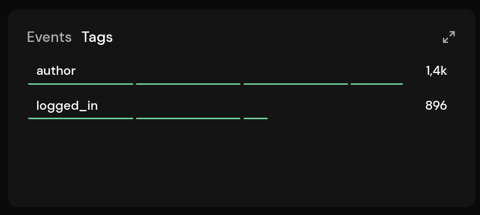
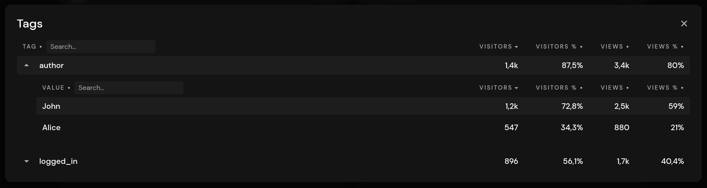
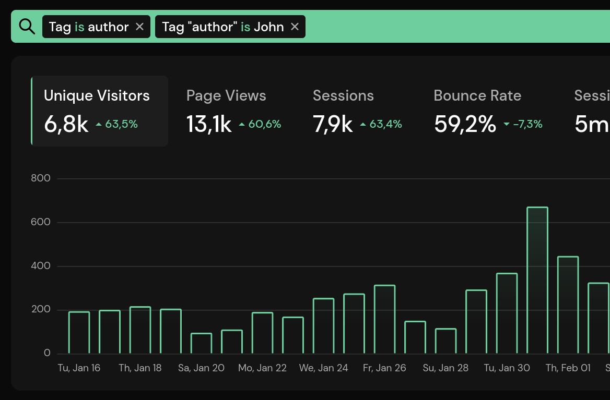

# Tag-Based Segmentation and A/B Testing

You can attach custom properties (called tags) to page views and events. Tags allow you to segment your audience based on data that we do not automatically collect. Tags are attached to events as custom properties when you use the JavaScript snippet, or they can be set on page views and events through the server-side API integration.

Here are some examples of what you can do with tags:

* Filter content by author, translation language, publication date, or category
* Filter users by login status, role, or settings (light/dark mode)
* Implement A/B testing, allowing you to see which variation of your site was viewed

::: info
Tags are a Pirsch Plus feature. If you do not have a Pirsch Plus subscription, tags will be dropped.
:::

::: danger
You must ensure that no [Personally Identifiable Information (PII)](https://en.wikipedia.org/wiki/Personal_data) is sent within a metadata field. All other information is anonymized, as is the case for page views. PII includes any information that can be used to uniquely identify an individual, such as the full name, email address, phone or credit card number, etc.
:::

## Tracking Tags

Before you can use tags in the dashboard, you need to attach them to page views and events. In this section, you'll learn how to do this on your page using JavaScript and from your server using the API.

### Sending Tags From Your Website

You can send tags from your website by adding them to the JavaScript snippet. By default, the snippet looks like this:

```html
<script defer type="text/javascript" src="https://api.pirsch.io/pirsch-extended.js"
    id="pirschextendedjs"
    data-code="identification_code"></script>
```

To add tags, simply add attributes to the HTML `script` tag.

```html
<script defer type="text/javascript" src="https://api.pirsch.io/pirsch-extended.js"
    id="pirschextendedjs"
    data-code="identification_code"
    data-tag-author="John"
    data-tag="food,vegetarian"></script>
```

In this example, three tags are sent for page views and events:

* author=John
* food
* vegetarian

The prefix must be `data-tag`. If you do not add a key (`data-tag-(key)`), the values inside the quotes will be used instead. The value is set to **1** in that case. Keys in `data-tag` are separated by commas. In this example, the tags `food` and `vegetarian` are used as categories, so they don't need a value.

For `data-tag-author="John"` the key will be set to `author` and the value to `John`.

When you set tags on the snippet, they are automatically attached to events as custom metadata. Triggering an event will always include the tags on the page.

For A/B testing and the like, we recommend setting the tags programmatically. With PHP, you could simply change them in your template. With JavaScript, you could construct the snippet and append it to the page after it loads. Here is an example of how to accomplish both methods.

**PHP**

```php
<script defer type="text/javascript" src="https://api.pirsch.io/pirsch-extended.js"
    id="pirschextendedjs"
    data-code="identification_code"
    <?php
        // Conditionally add the author tag.
        if (someCondition) {
            echo 'data-tag-author="John"';
        }
    ?>
    ></script>
```

**JavaScript**

```js
const snippet = document.createElement("script");
snippet.src = "https://api.pirsch.io/pirsch-extended.js";
snippet.id = "pirschextendedjs";
snippet.setAttribute("data-code", "identification_code");

// Conditionally add the author tag.
if (someCondition) {
    snippet.setAttribute("data-tag-author", "John");
}

document.body.appendChild(snippet);
```

### Sending Tags From Your Server

Sending tags using the [server-side integration](../get-started/backend-integration) is easy and requires only a small modification to your API request. Simply add the tags you want to send to the page view request **and** event requests if you are sending custom events.

Here is an example. For brevity, it doesn't include all the required fields.

```JSON
{
    "url":                          "https://example.com",
    "ip":                           "123.456.789.0",
    "user_agent":                   "User-Agent header",
    "accept_language":              "en",
    // ...
    "tags": {
        "author": "John",
        "food": "1",
        "vegetarian": "1"
    }
}
```

The same `tags` object must be appended to all custom event requests for the page. The JavaScript snippets will automatically append it, but the API is unaware of other requests. If you do not send them for the events as well, filtering may not work completely correctly.

## Dashboard and Filtering

Once tags are set up, you can view them in the **Tags** panel next to **Events**.



This will only show keys. To see all tags including their values, you can open the details view by clicking the expand icon in the upper right corner of the panel. This is very similar to the event metadata.



Clicking a key or value filters the entire dashboard. You can also select a tag key from the lens icon next to the date selection. Clicking the **is** can be used to invert the tag filter or to search for tag values that contain a specific string.

In this example, the dashboard will only show results where the author is set to **John**. For a blog, for example, this would return only blog posts written by John.


