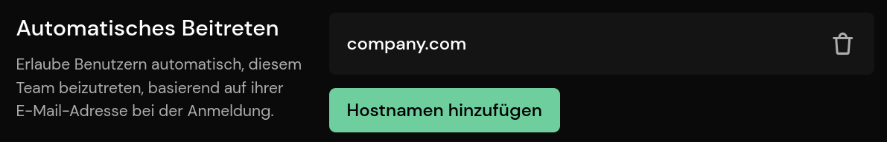

# Teams

::: info
Teams (previously called Organizations) are a Pirsch Plus feature.
:::

Teams allow you to group dashboards, provide access to team members and customers, and apply [themes](/advanced/theme).

They can be accessed from the user menu in the top right corner.

Each member has a role, which can be either Owner (you), Administrator, or Viewer. The Owner requires an active subscription. Administrators can add sites and manage settings on your behalf. They can use themes assigned to the team. Viewers have read access to all sites belonging to the team and are useful if you have clients with multiple sites, for example.

You can have members join your teams automatically by adding an auto-join domain. Team members who have the host name in their e-mail address (for example, `@microsoft.com`) are automatically added to your team when they sign up.

Teams are **not** white-labeled. Unlike invitations to dashboards, members must have an account on Pirsch. Only direct invitations to dashboards are themed and will use the custom domain if configured.

## When to Use a Team

You can use an team to manage your dashboards in the following cases:

* Team members need to be able to create dashboards on your behalf and add them to your subscription. Only sites that belong to an account with an active subscription will be tracked, and your team members don't need individual subscriptions.
* Resell our service to your clients and give them access to one or more dashboards
* You want to share a base theme with all your clients
* Eliminate the need to assign team members to each dashboard individually
* Have team members automatically join your team based on their email address

## Overwrite Settings

It's possible to override team settings. For example, if a team member who is added to a dashboard is also added to the team to which the dashboard belongs, the dashboard permissions will override the team settings.

You can also override the basic theme settings on the [themes settings page](/advanced/theme).
