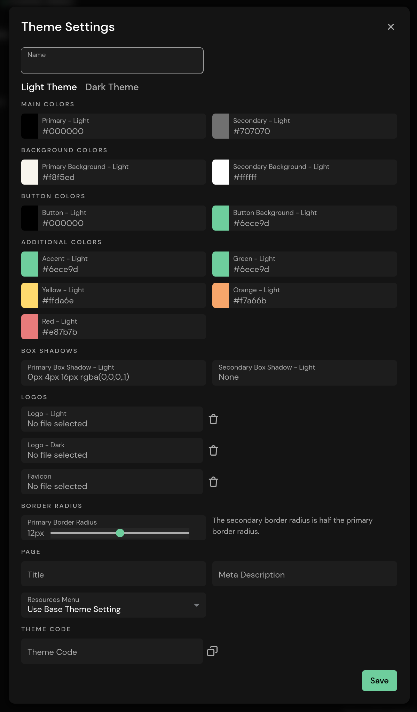
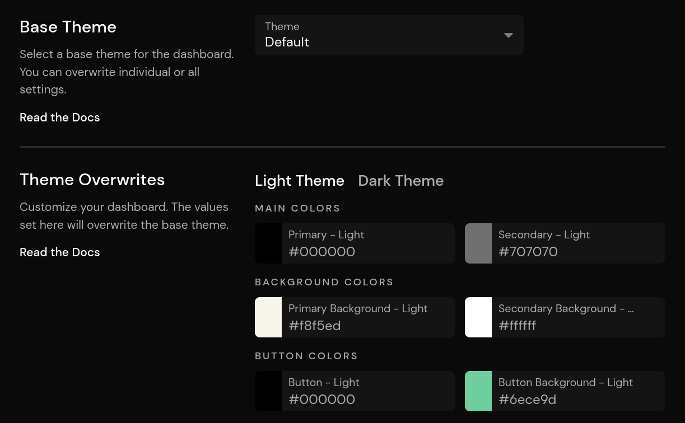

# Theming

::: info
Themes are a Pirsch Plus feature.
:::

The dashboard is completely customizable. You can change the colors, border radius, metadata, logo, and more to white label Pirsch and make it your own.

To create a theme, navigate to the settings page from the user menu in the top right corner. It's also possible to create a theme for an organization(/advanced/access#organizations). Themes can be shared across multiple dashboards and are visible on [Custom Domains](/advanced/custom-domains).

## Creating a Theme

To create a theme, click **Add Theme** on the theme settings page or the organization page. You'll then be presented with all the configuration options.

Colors, border radius, and logos can be set individually for the light and dark modes of the dashboard. When you open the dialog, the default or base theme colors are displayed. To change a color, click on the box of each color and select one. You can also insert a RGB hex code. Clicking the cross will reset the color to the default.

The logos are displayed instead of the Pirsch logo in the upper left corner. The favicon is displayed in the browser tab. The metadata is rendered in the HTML of the dashboard. This is only visible when sharing a link to a (public) dashboard on social media.

## Copying and Sharing a Theme

Themes can be shared by copying the **Theme Code** at the bottom of the configuration dialog. Simply send it to someone and they'll be able to copy and paste it into the field when creating or editing a theme. This can also be used to copy themes between your account and organizations.

## Selecting a Theme When Adding a Dashboard

To enable a theme, navigate to the settings page of a dashboard and go to the **Theme** tab.

The **Base Theme** setting applies all settings of the selected theme to the dashboard. The **Theme Overwrites** can be used to override individual settings, for example to change the logo for a client.
