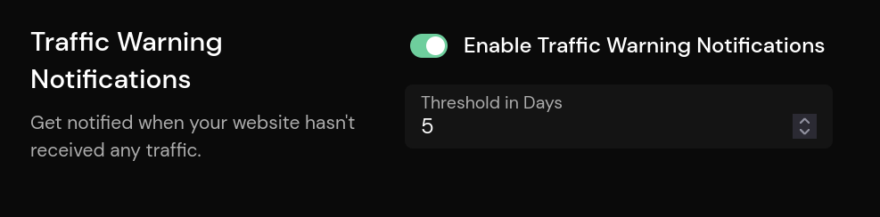

# Traffic Alerts

Traffic alerts are very useful to make sure that Pirsch is collecting traffic on your site, even if you are not constantly checking the dashboard.

A threshold (in days) can be set on the **Reports** settings page. If your site hasn't received any traffic within the configured period, all administrators will receive a warning email.

