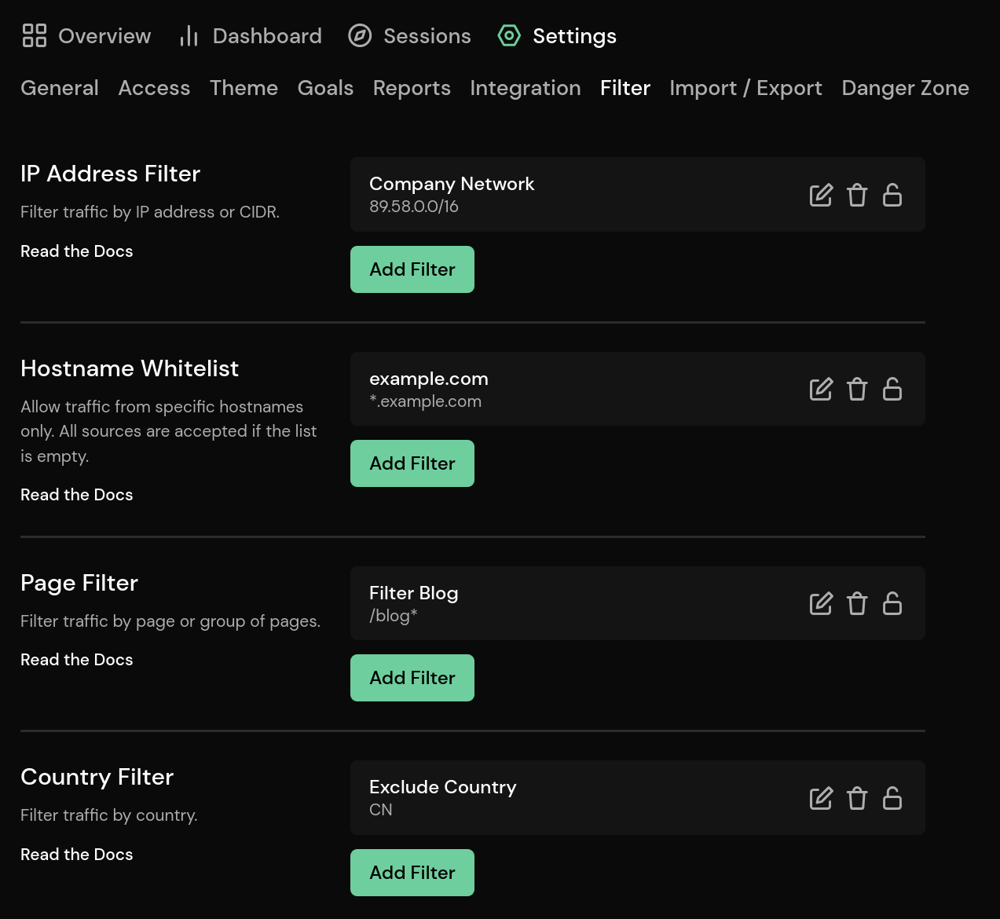

# Traffic Filter

Traffic filters allow you to exclude traffic for specific IP addresses, networks, countries, hostnames, and pages.

::: info
Changes to the traffic filter don't take effect immediately. It may take a few minutes for them to take effect.
:::

## Filtering IP Addresses and Networks

To filter for a specific IP address, navigate to the **Filter** settings page and click **Add Filter** in the **IP Address Filter** section. Enter the IP address and click save. All IPv4 and IPv6 addresses are valid, such as `89.58.72.204` and `2a11:fb80:0:ae02::742e`.

Filtering for a network works in a similar way, but instead of entering an IP address, you enter the network mask (CIDR). For example, entering `89.58.0.0/16` would filter out all IP addresses starting with `89.58`.

## Filtering Hostnames

Hostnames can be white listed. If no entry is present, all hostnames will be accepted. To add hostnames to the whitelist, navigate to the **Filter** settings page and click **Add Filter** in the **Hostname Whitelist** section. Enter the hostname and click save.

Wildcards are supported. You can use an asterisk (`*`) to replace any part of the hostname. Here are some examples:

* `example.com` will match example.com exactly. Traffic from any other domain or subdomain will not be accepted.
* `*.example.com` will match any subdomain of example.com, but will not match example.com itself.
* `*example.com` will match any subdomain of example.com and example.com itself.

## Filtering Pages and Page Sections

To filter for a page or page sections, navigate to the **Filter** settings page and click **Add Filter** in the **Page Filter** section. Enter the path and click save. You can enter an exact path or use single or double asterisks (*) to match a path.

You can use single or double asterisks as wildcards for parts of the path. A single asterisk is used as a wildcard for a single part of the path. It matches anything that is not a forward slash (with a length of zero or more). Double asterisks are used to match multiple parts of the path, including slashes (with a length of zero or more). Here are a few examples:

| Pattern | Description |
| - | - |
| `/` | Exact match. |
| `/home` | Exact match. |
| `/**` | Matches all paths. |
| `/blog/*` | Matches the pages below `/blog`, like `/blog/article`, but not `/blog/article/first`. |
| `/blog/**` | Matches all pages below `/blog`, like `/blog/article` and `/blog/article/first`. |
| `/blog/*/first` | Matches all pages below `/blog` that end with `/first` with one part in between, like `/blog/article/first`, but not `/blog/page/first` or `/blog/some/page/first`. |
| `/blog/**/first` | Matches all pages below `/blog` that end with `/first` with one or more parts in between, like `/blog/article/first` or `/blog/some/page/first`, but not `/blog/some/page/second`. |

## Filtering Countries

To filter for a country, navigate to the **Filter** settings page and click **Add Filter** in the **Country Filter** section. Select the country from the list and click save.

## Client Side Filtering

Additionally to filter, you can also disable Pirsch client side by adding a variable called `disable_pirsch` to your local storage. The value can be anything.

For the latter option, open the developer tools (usually F12 or `Ctrl + Shift + I`) in your browser and navigate to the **web storage** tab. Click on **local storage** and add a new value `disable_pirsch` and `1` as the value. After reloading the page, no page views or events (if you also use the event script) should be sent to Pirsch.
