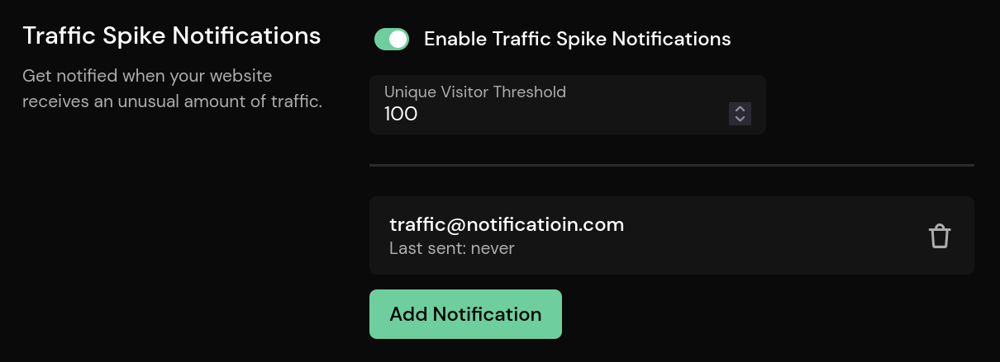

# Traffic Spike Notifications

Traffic spike notifications allow you to be notified when a certain number of concurrent unique visitors is reached.

The threshold can be set on the **Reports** settings page and will be sent to the configured email addresses when it is reached.

Once reached, it will not be sent for the next 12 hours.
