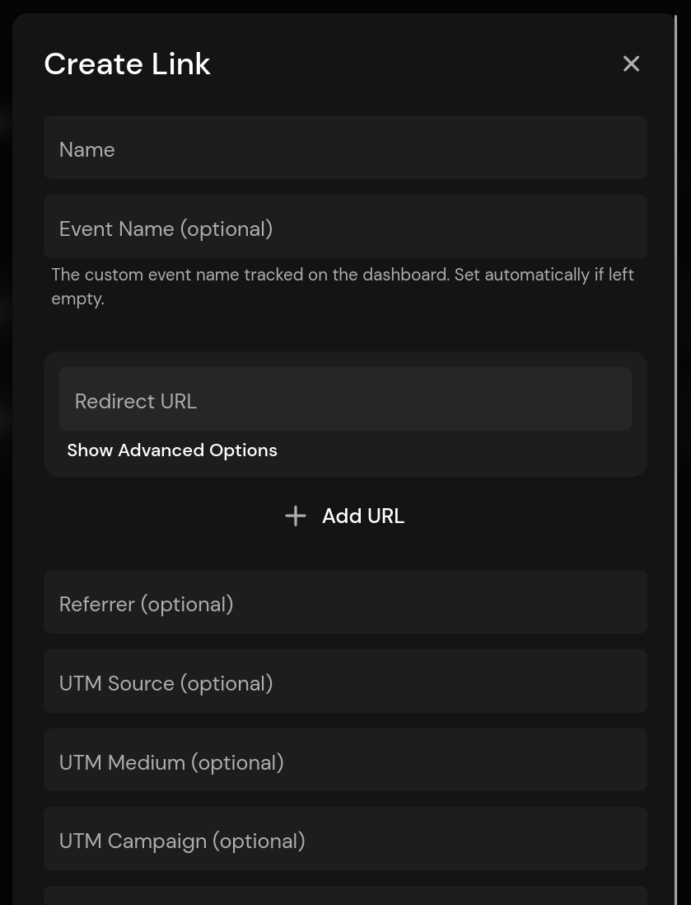
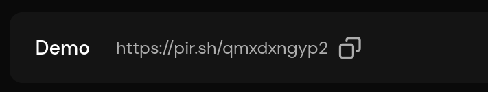
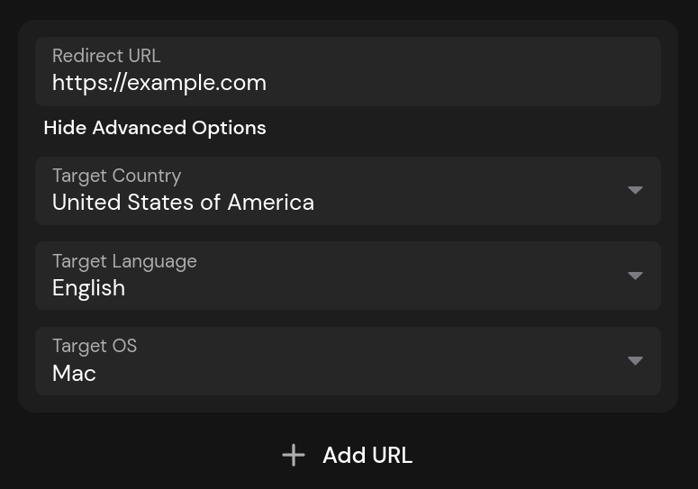
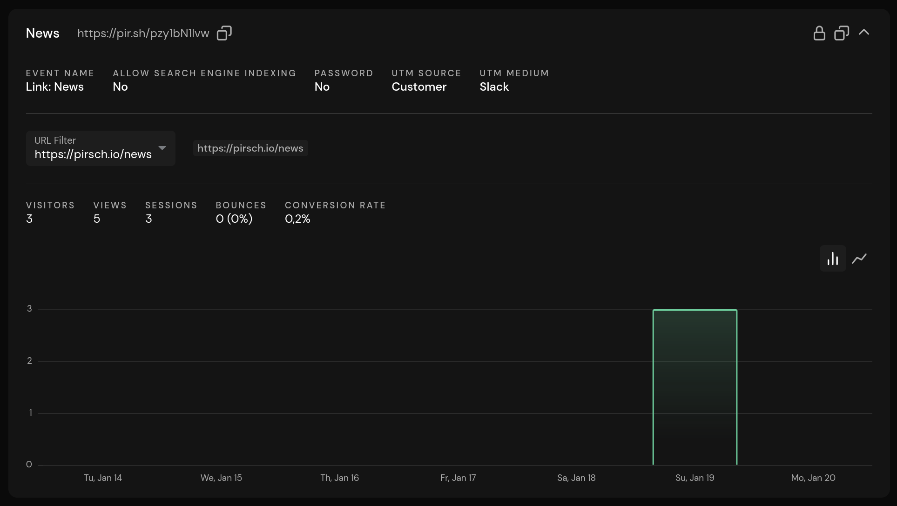

# Shortening and Tracking Links Using the Built-in URL Shortener

Pirsch has an integrated URL shortener. Unlike other URL shorteners, it's directly connected to your dashboard, creating sessions on redirection and guaranteeing that the source (referrer and UTM parameters) is reliably tracked. Tracking parameters do not rely on the link being forwarded correctly using query parameters, which are often stripped by ad blockers.

The data is tracked as a non-interactive custom events, making it convenient to access. Non-interactive means that the sessions will continue to be counted as bounced.

## Features

The URL shortener has the following options

* Track one or more URLs
* Track referrer and UTM parameters
* Enable or disable search engine indexing
* Redirect based on country of origin, language and operating system (Plus plan)
* Link expiration and redirection to a special page when expired (Plus plan)
* Password-protected links (Plus plan)
* Webhooks (Plus plan)
* Customizable meta title, description, and social media image (Plus plan)
* Theming (Plus plan)

## Shorten a Link

To shorten a link, navigate to the *Links* page and click *Add Link*. You can also select it from the *Plus* drop-down menu in the upper right corner of the dashboard.

Specify a name and at least one URL. The event name is optional and defaults to `Name: <link name>` by default. Set the Referrer and UTM parameters to ensure that the source is correctly attributed. For example, if you're tracking an ad campaign on Google, you should set the referrer (full URL) to `https://google.com` and any UTM parameters you like. You can use our [UTM Generator](https://pirsch.io/utm-generator) if you like.

After hitting *Save*, the link will be added to the list. You can search for it by name or tag using the search box at the top right.

Copy the shortened link by clicking on the copy icon. Now you can use it anywhere! Visitors will be redirected immediately when they click on the link.

## Advanced Options

The URL shortener is quite versatile and offers options to treat visitors differently based on location, language, or operating system. You can also password protect links or make them expire. For social media, the meta title, description and image can be customized.

### Redirecting Visitors Based on Location, Language, or OS

To redirect a visitor based on country of origin, language, or operating system, click *Show Advanced Options* below the redirect URL. Select the destination country, language, and operating system for the link. You may use more than one variable.

Click the *Add URL* button to add another URL. Again, you can select the target options to redirect the visitor to a specific URL. The redirect will always choose the best match. If there is no match, it will fall back to the default (no options configured) or simply pick the first one in the list.

### Search Engine Indexing

If you check *Allow Indexing*, the redirect page will be indexed by search engines. Otherwise, we disallow indexing of the pages by default to prevent SEO issues on your site.

### Link Expiration

Links can be set to expire on a specific date. Open the *Show Advanced Options* section to view the options. You can select a date on which the link will expire and a redirect URL. If the redirect URL is left blank, visitors will see a simple page stating that the link has expired.

### Password Protection

Links can be password-protected. Open the *Show Advanced Options* section to view the options. Enter a password and save the link. If you want to clear the password, you can check the Clear Password box.

### Webhooks

Webhooks are attached to custom events in Pirsch. They allow you to receive a system notification when they are set. Enter the endpoint URL to create a new webhook or delete it to remove the webhook.

To learn more about webhooks, see the [Webhooks section](/advanced/webhooks).

### Customizing the Meta Title, Description, and Image

The meta title, description and image can be customized. This is useful when posting the link to social media, as they will be used to generate the link preview. Images must be hosted externally, we only support entering a URL.

## Dashboard and Statistics

After the link is clicked, the statistics are displayed in the link card on the page. Expand a link to see the statistics. You'll also find the configuration there, and you can filter for a specific URL if more than one has been configured.

Any filter applied to the dashboard also applies to the link statistics. If you wish, you can filter the entire dashboard by selecting the custom event generated by the URL shortener and optional meta data options. The event can be found in the regular custom events panel on the main dashboard.
