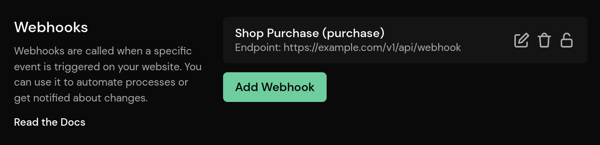

# Webhooks

::: info
Webhooks are a Pirsch Plus feature.
:::

Webhooks are a way to be notified programmatically when a [custom event](events.md) is triggered on your site. When an event is triggered by a visitor, we'll look to see if one or more webhooks are attached to it. If so, we'll call the configured HTTPS endpoint with the event in the body.

Here are some examples of use cases:

* A purchase is made in your online store
* A new user has registered
* an error has occurred on your website or server

## Configuring Webhooks

Webhooks are configured on the **Integration** settings page.



Click **Add Webhook** to create a new webhook.


Enter a description, the name of the custom event that will trigger the webhook, and the HTTPS endpoint of your service.

That's all you need to do! It may take a few minutes for your configuration changes to take effect.

## Handling the Webhook

Once set up, we'll start sending HTTP POST requests to the configured endpoint. Only if the event is actually saved will the request be made. It may be dropped by the bot filter. The event that triggered the webhook is sent in the body as JSON, including any attached metadata.

The webhook must respond with an HTTP status code of 200 (200 or greater and less than 300), otherwise we'll consider the request to have failed. If the webhook fails more than 100 times, it will be disabled. You can re-enable the webhook by editing it and saving it. You don't have to change anything. An alert email is also sent so you'll know when a webhook has failed.

To handle the webhook, set up a server that's accessible from the Internet via HTTP. Respond with a status code of 200. The body will contain any custom event fields and will look like this

```json
{
    "event_name": "purchase",
    "event_duration": 42,
    "event_meta": {
        "amount": "199.99",
        "currency": "USD"
    }
}
```

`event_meta` is a flat key-value object, where both the key and the value are strings.
