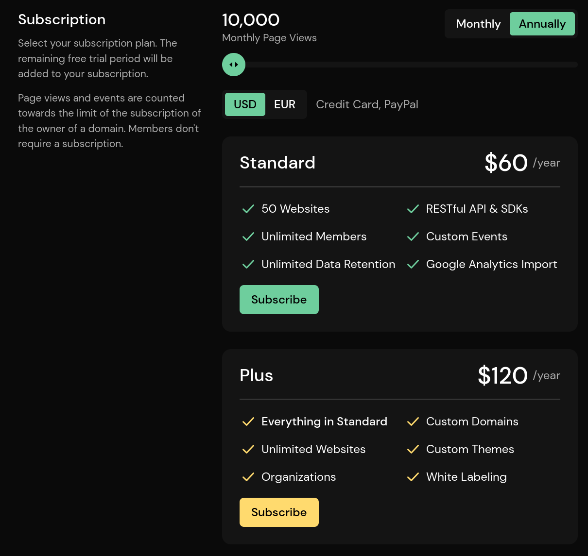

# Billing

## Managing Your Subscription

After your 30 day free-trial or 100,000 page views, you will have to subscribe to keep using our service. You will be notified a few days before your trial ends, so that you will have enough time to upgrade your subscription. Should you decide not to upgrade, we will stop analyzing the traffic for your websites and the date filter on the dashboard will be limited to the end of your free-trial.

To manage your subscription, navigate to the billing page from the top-right menu.

The page shows your current page view usage for all of your domains (including deleted domains). Click on *Show Details* to view individual domains. Below, you have the option to receive a warning notification by email if you reach a certain percentage of your usage limit. You can also disable it. The usage limit is updated once a day.

To start a subscription, select the billing cycle and subscription plan from the menu and click *Checkout*. This will redirect you to our checkout page. Payments, subscriptions, and credit card numbers are managed by [Stripe](https://stripe.com/). We do not save your payment details by ourselves. After you have subscribed, you will be redirected back to our dashboard. To change your plan, cancel your subscription, or update your payment details, click on the **Manage Your Subscription** button. This will redirect you to the Stripe portal.

Should you not see the **Manage Your Subscription** button after you have successfully subscribed, please wait a few minutes and refresh the page. It might take a few minutes before your subscription is activated.

## The Page View Limit

The page view limit is bound to your subscription plan. On your free-trial, you will have 100,000 page views before you need to subscribe to one of our plans. The limit is updated once a day and reset after a month. You can see the reset date below the subscription limit progress bar.

Deleted domains count towards your page view limit and will be reset at the end of the billing cycle.

## Where Do I Find My Invoices?

You can find your invoices on the Stripe portal. Navigate to the billing page from the top right menu and click **Mangage Your Subscription**.

## What Happens if I Reach the Limit?

Should you reach the usage limit before the end of the month, your access will be limited to the day you reached the limit. We will keep collecting data for your websites for five days, before we stop accepting page views. To regain access to your statistics and prevent gaps, upgrade your plan within those five days or wait until your usage limit has been reset.

## What Happens if I Delete My Account?

Should you mark your account for deletion on the account settings page, your subscription will be stopped. When your account is finally deleted, the subscription will be cancelled immediately. Should you stop the deletion process, your subscription will be continued. In case you change the subscription plan while your account is marked for deletion, the deletion will be cancelled, and you will keep your account.

## Payment Methods

Right now, we offer the following payment methods:

* Credit Card
* Apple Pay

We plan to add more payment methods in the future. In case you need a specific payment method, feel free to [contact our support](mailto:support@pirsch.io).

## Refunds

We don't offer refunds. When you upgrade or downgrade your subscription, the difference will be added or removed from your account balance. If you downgrade from a more expensive plan for example, the amount for the remaining time of your billing cycle will be added to your balance. Should you upgrade later, your balance will be used first, and you only need to pay the difference. On account deletion, the remaining balance is discarded.
