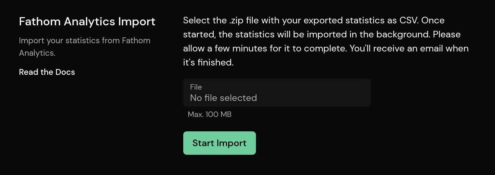

# Importing Your Statistics From Fathom Analytics

You can easily switch from Fathom Analytics to Pirsch by importing your historical data via CSV files.

::: info
There are limitations on what you can do with imported statistics. Please refer to the [Google Analytics Import](/get-started/ga-import) documentation for details.
:::

## Import

To import your data from Fathom Analytics, you must first export a `.zip` file containing the exported statistics as CSVs. You can learn how to do this from their [docs](https://usefathom.com/docs/features/exporting).

After you have set up your site on Pirsch, go to **Import / Export** in the settings, scroll down to the **Fathom Analytics Import** section, select the `.zip` file and click import.

That's all you need to do! The import will run in the background and you'll receive an email when it's finished. You'll also be notified if there's an error. Please keep in mind that the upload limit is 100 MB and you can split the files if that's not enough for you.

## Failed Import

If you receive an email telling you that your import has failed, you can delete the incompletely imported stats (under **Danger Zone**) and try again. In this case, we recommend that you import your statistics in smaller increments.

## Deleting Imported Statistics

You can delete your imported statistics by going to the **Danger Zone** settings page. Click on **Delete Data** and select the start and end date for the imported statistics.
