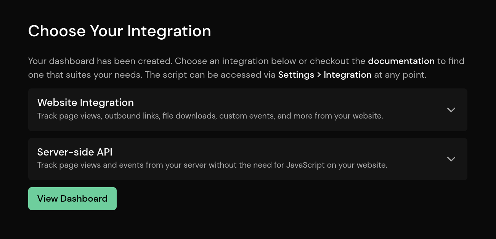

# Website Integration

Our JavaScript snippet is the easiest way to integrate Pirsch into your website. If you don't want to load JavaScript on your website, have a look at our [server-side integration](/get-started/backend-integration) and [custom domains](/advanced/custom-domains).

::: info
Looking for code? Check out our [demo repository](https://github.com/pirsch-analytics/demo) on GitHub!
:::

## Adding Pirsch to Your Website

Once you have created your account, you can add Pirsch to your website.

1. Open the dashboard and click on the **plus icon** in the menu.
2. Enter the hostname of your website (such as **example.com**), the subdomain, and select a time zone.
3. Click on **Create Dashboard**.
4. Select and open your preferred integration.
5. Copy and paste the JavaScript snippet into the `<head>` section of your website.



And you're done! Your website is now sending traffic to Pirsch.

Note that only page views for the hostname you enter will be accepted. A pageview for **sub.example.com** will not be accepted if you've configured **example.com**. They are considered completely different websites and you will need to add a new dashboard or create an [additional domain](/advanced/domains-rollup) for them.

You can also create [rollup views](/advanced/domains-rollup) to combine data from multiple sites.

The script also tracks programmatic URL changes by default. This is useful if your site is a single page application (SPA) or if you use anchors. You can disable this behavior by adding the `data-disable-history` parameter to the script. This also works for the `pirsch-extended.js` script. Certain features might not work on SPAs. [Check the troubleshooting article](/get-started/troubleshooting) to learn more.

Client Hints improve the accuracy of the statistics collected for you. Make sure to [forward them](/get-started/client-hints) to our service.

## Choosing a Scripts

There are currently four scripts, each with a different purpose.

* `pirsch-extended.js` is the full integration and combines all the other scripts. It automatically tracks outbound link clicks, file downloads, and allows tracking of custom events through HTML, CSS, and JavaScript.
* `pirsch.js` is the basic integration and **only** tracks page views.
* `pirsch-events.js` tracks **only** programmatic events through JavaScript. This is usually combined with `pirsch.js` so that you have two very lightweight scripts on your site.
* `pirsch-sessions.js` automatically renews sessions. This can be useful for long running sessions without page switching.

## Testing the Integration

Please refer to the [troubleshooting article](/get-started/troubleshooting).

## Including and Excluding Pages

The snippet provides a very flexible way to include or exclude pages. You can exclude one or more pages by specifying the `data-exclude` attribute. The content is a list of regular expressions used to filter pages.

```html
<script defer src="https://api.pirsch.io/pirsch.js" 
    id="pirschjs" 
    data-code="YOUR_IDENTIFICATION_CODE"
    data-exclude="\/exact\/match,\/exclude\/page\/(en|de)\/.*"></script>
```

This example will match the page `/exact/match` and any page starting with `/exclude/page/en/` or `/exclude/page/de/`.

Please always [validate](https://regex101.com/) your expressions before using them and make sure you don't see any errors in the browser console. Special regex characters must be escaped. For a simple single page filter use a pattern like `\/your\/page`.

`data-include` can be used to whitelist pages. With whitelisting, only pages that match a pattern in the list will send a page view. The blacklist still applies.

## Enabling/Disabling Certain Features

It's possible to enable or disable certain features of the scripts. To enable or disable a feature, simply add an attribute to the script tag.

* `data-disable-query` removes all query parameters from the URL, including UTM parameters.
* `data-disable-referrer` will removes the referrer.
* `data-disable-resolution` removes the screen resolution (width and height).
* `data-disable-history` disables the tracking of programmatic URL changes as page views (like PWAs for example).
* `data-disable-page-views` disables the collection of page views (`pirsch-extended.js` only).
* `data-disable-outbound-links` disables the tracking of outbound link clicks (`pirsch-extended.js` only).
* `data-disable-downloads` disables the tracking of file downloads (`pirsch-extended.js` only).
* `data-enable-sessions` enables [session extension](/advanced/sessions) (`pirsch-extended.js` only).

Here is an example:

```html
<script defer src="https://api.pirsch.io/pirsch.js" 
    id="pirschjs" 
    data-code="YOUR_IDENTIFICATION_CODE"
    data-disable-query></script>
```

## Adding a Suffix/Prefix to the Path Title

It's possible to alter the page path and/or title. For example, setting the `data-path-prefix` on the script to `/blog` and visiting your website on `/article/1` would be displayed as `/blog/article/1` on the dashboard.

Here is how that would look like for the script:

```html
<script defer src="https://api.pirsch.io/pirsch.js" 
    id="pirschjs" 
    data-code="YOUR_IDENTIFICATION_CODE"
    data-path-prefix="/blog"></script>
```

To add a prefix or suffix, or to change the page title (displayed in the browser tab), add one of the following attributes:

* `data-path-prefix` adds a path prefix
* `data-path-suffix` adds a path suffix
* `data-title-prefix` adds a path prefix
* `data-title-suffix` adds a path suffix

Please not that the attributes interacts with the `data-domain` attribute used to create [rollup views](/advanced/domains-rollup.md).

## Ignoring Your Own Page Views

You can disable this integration by setting the DNT (Do Not Track) header to `1` in your browser, or by adding a value called `disable_pirsch` to your local storage.

For the latter option, open the developer tools (usually F12 or `Ctrl + Shift + I`) in your browser and navigate to the **web storage** tab. Click on **local storage** and add a new value `disable_pirsch` and `1` as the value. After reloading the page, no page views or events (if you also use the event script) should be sent to Pirsch.

## Testing Pirsch Locally

The scripts will ignore any requests made on localhost. If you want to override this behavior, e.g. for testing, you can add the `data-dev` attribute. The host names must match. If you are testing on localhost, rewrite the hostname with the `data-dev' attribute like this

```html
<script defer src="https://api.pirsch.io/pirsch.js" 
    id="pirschjs" 
    data-code="YOUR_IDENTIFICATION_CODE"
    data-dev="example.com"></script>
```

In this case, the hostname you've configured on the Dashboard is `example.com`. So you need to add `data-dev="example.com"` to rewrite the hostname.

## Resetting the Identification Code

Your site is identified by the host name from which the request is made and an identification code. The identification code must be placed inside the JavaScript snippet. If you ever need to recreate the code, go to the Settings page for your site and generate a new one. You'll then need to replace the old code.

```html
<script defer src="https://api.pirsch.io/pirsch.js" 
    id="pirschjs" 
    data-code="YOUR_IDENTIFICATION_CODE"></script>
```

## Custom Domains

It's possible to serve the Pirsch scripts from your own domain. You can learn how to do this [here](/advanced/custom-domains.md).

## Privacy Policy

If required in your country, you can use our [template](/privacy#privacy-policy-template) to add a paragraph to your privacy policy about the use of Pirsch.
