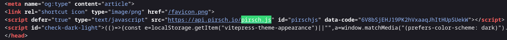
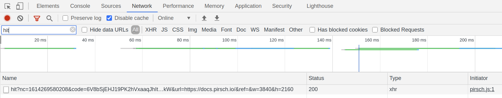

# Troubleshooting

This is a collection of methods to test if your Pirsch integration is working properly. If you are missing something, please don't hesitate to contact our [support](mailto:support@pirsch.io).

## Make Sure the Snippet Is Installed

Before trying other troubleshooting methods, make sure that the snippet is installed on your website if you are using the [website integration](/get-started/frontend-integration).

1. Visit your website.
2. View your website's source code. You can do this by pressing `Cmd + U' on a Mac or `Ctrl + U' on Windows and Linux. Alternatively, you can right-click anywhere and select **View Source** from the context menu.
3. Search for `pirsch.js` (using `Cmd + F` on Mac or `Ctrl + F` on Windows and Linux). You should be able to find the snippet as shown in the screenshot below. The `data-code` attribute must match the integration code from the [Settings page](/get-started/frontend-integration#resetting-the-identification-code).



## Test the Snippet Integration

To test the script, navigate to your website and open the network tab of the developer tools in your browser (usually F12 or `Ctrl/Command + Shift + I`). Search for 'hit' and make sure you get a 200 response code in the status column.



If not, check the identification code and domain you've configured. Also make sure you haven't set the `disable_pirsch` option in your localStorage, or added the script to your site more than once.

## Ensure That You Have Installed the Right Script

::: info
Since Pirsch version 2.3 there is only one consolidated script (`pa.js`). If you installed Pirsch before the update, you may encounter the problem described below.
:::

There are a number of different scripts that provide different functionalities. Not all of them track page views. So if you don't see visitors in your dashboard, make sure you have the right scripts installed:

* `pirsch-extended.js` and `pa.js` provide all the features, you don't need anything else and page views will be collected automatically.
* `pirsch.js` only tracks page views. Custom events and other features are not supported.
* `pirsch-events.js` only tracks events triggered by JavaScript, page views are not collected.
* `pirsch-sessions.js` automatically extends the lifetime of sessions and does not track page views.

## Test the Servers-side Integration

To test the [server-side integration](/get-started/backend-integration), log any errors returned by the Pirsch API that don't have the HTTP status codes 200 (ok) or 401 (unauthorised). The body of the response will include error and validation messages.

```
{
    "validation": {
        "field": "error message"
    },
    "error": [
        "error message"
    ],
    "context": {
        "key": "value"
    }
}
```

You can simply log the whole body, or parse it and log only parts of it. Here is an example from our JavaScript SDK.

```js
client.hit(client.hitFromRequest(request)).catch(error => {
    // Something went wrong, check the error output.
    console.error(error);
});
```

If you don't see any errors and you still don't see any statistics on your dashboard. Make sure all fields in [the request](/api-sdks/api#sending-page-views) are correct.

We block certain IP addresses, so if your service is behind a load balancer or proxy, make sure it's forwarded to your server correctly, otherwise we'll get your server's IP address instead of the visitor's IP address. For example, most reverse proxies will return the visitor's real IP address in the `X-Forwarded-For` header. Our SDKs help you deal with these situations.

## Visits Are Not Appearing on the Dashboard

If you don't see your visits on your dashboard immediately, don't worry. There is usually a small delay of a few seconds as we cache page visits before writing them to the database.

In case you don't see your visits appearing after a small delay, make sure you didn't [disable Pirsch](/get-started/frontend-integration#ignoring-your-own-page-views) nor have an ad blocker or a VPN active. In rare cases, your page views might be blocked by our bot filter. Try a different device on a different network in that case.

## Tracking Page Views via API Returns 200, but No Data Appears on the Dashboard?

If you're tracking page views and events via the API and you receive an HTTP status code of 200 (OK), it doesn't necessarily mean that we've actually saved the page view or event. The tracking endpoints always return a status code of 200 (unless you pass invalid or incorrect data, such as an invalid access key), so we don't provide a method to learn how to bypass our bot filtering.

Requests accepted by these endpoints are processed asynchronously and may be dropped if we think it's a bot request. When testing, make sure you're not behind a VPN or proxy, and that you have a proper user-agent configured in your browser.

## Script Features Are Not Being Tracked (Outbound Link Clicks, File Downloads, Custom Events)

When running the `pirsch-extended.js` or `pirsch-events.js` script in combination with a Single Page Application (SPA) built with frameworks like React, Vue, Angular, Svelte, etc. to track outbound link clicks, file downloads, or custom events, you may run into the problem that certain features do not work.

Page views usually work fine, but tracking custom events or clicks (on an outbound link, for example) may not work. This is because the script may be loaded **before** the SPA has finished rendering the HTML of your web application. As the script scans the HTML for links and attributes to add events to, it will find nothing, and so will not add any event handlers.

To fix this, you can either delay loading the script, or better yet, use the [JavaScript SDK](/api-sdks/sdks). The SDK gives you full control over when an event is fired from your SPA code.

## I Cannot Sign In

If you have trouble signing in, try deleting your temporary browser files (cookies and local storage) and clear your cache. This can usually be done from the history settings in most browser. The cache can be cleared by reloading the page using `Ctrl/Cmd + Shift + R` or `Ctrl/Cmd + F5`.

To clean up cookies and the local storage, open the developer console (`Ctrl/Cmd + Shift + I`, `F12` or right click - inspect) and navigate to **Web Storage** (or similar). Select everything in the cookies and local storage tab and delete it.
