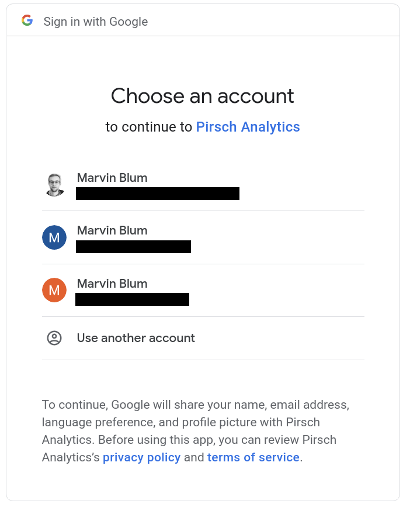
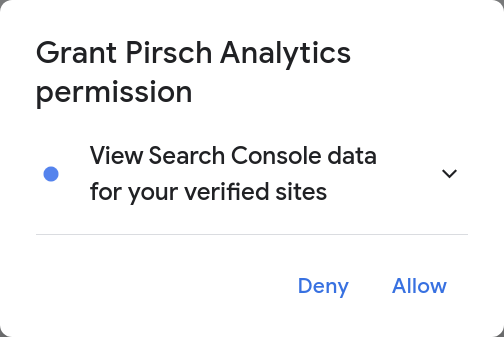
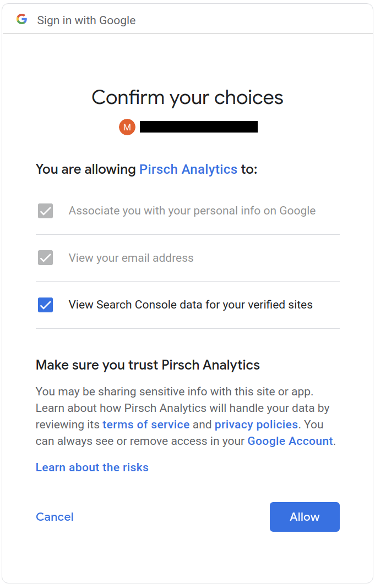
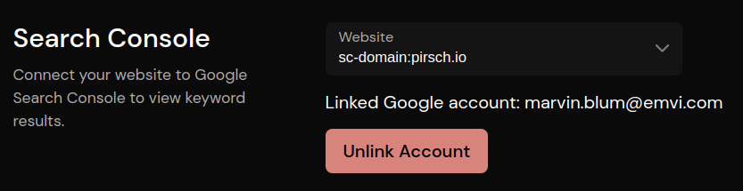

# Google Search Console

The integration can be used to connect your dashboard to Google Search Console. After activation, it will show a list of keywords on the dashboard visitors use to find your website. We use the minimal amount of data required to connect to your account. This includes your user ID, email address, and a refresh token. You can remove Pirsch from your account by navigating to the [Account Permissions](https://myaccount.google.com/permissions) page for your Google account.

Before you can use the integration, add your website to Search Console and verify that you are the owner of your domain. Afterwards, navigate back to the Pirsch dashboard settings page and follow these steps:

1. click on *Continue with Google*, this will redirect you to login with the Google account you would like to use to connect
2. select the account that has access to your property on Google Search Console 
3. grant access to your Search Console data 
4. confirm the choices on the next screen 
5. after you have been redirected back to the settings page, select the website you would like to pull data from. The list will only show **verified** sites 
6. navigate to the dashboard and check if you see a new panel *Keywords* with the data from the Search Console

In case you don't see any data, please wait a few hours. The data on Search Console is not updated in real-time, and it might take a while before you see the results.

In case you would like to remove the integration, click on *Unlink Account*.
