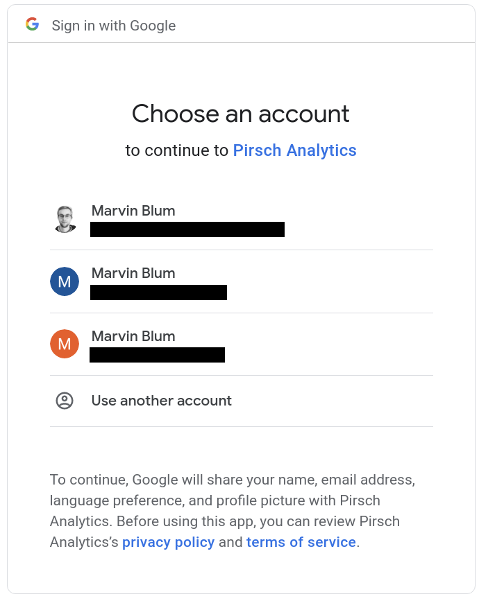
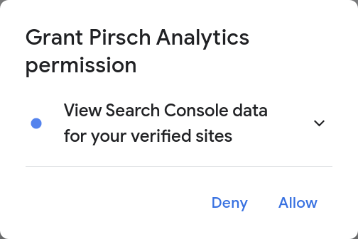
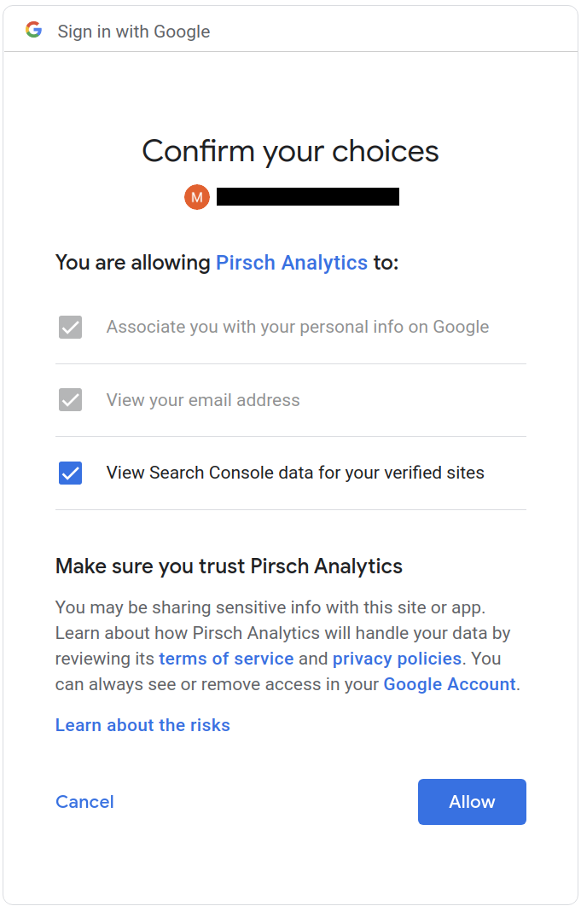
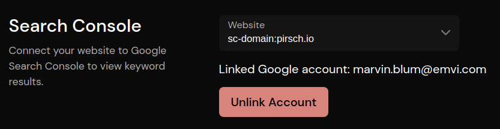

# Google Search Console

The integration can be used to connect your dashboard to Google Search Console. Once enabled, the dashboard will display a list of keywords that visitors are using to find your site. We use the minimum amount of data necessary to connect to your account. This includes your user ID, email address and an update token.

You can remove Pirsch from your account by going to the [Account Settings page](https://myaccount.google.com/permissions) for your Google Account.

Before you can use the integration, add your website to Search Console and verify that you own your domain. Then navigate back to the Pirsch Dashboard Settings page and follow these steps

1. click on **Continue with Google**, this will redirect you to sign in with the Google account you want to use for the connection
2. select the account that has access to your property in Google Search Console 
3. grant access to your Search Console data 
4. confirm your choices on the next screen 
5. when you are taken back to the Settings page, select the website you want to pull data from. The list will only show **verified** sites 
6. navigate to the dashboard and check if you see a new panel **Keywords** with the data from the search console

If you don't see any data, please wait a few hours. The Search Console data is not updated in real time and it may take a while before you see the results.

If you want to remove the integration, click on **Unlink Account**.

Once active, you can filter for keywords on the dashboard by clicking an entry in the list within the panel. Note that we do not know which sessions a keyword belongs to, so we'll apply the pages viewed using that keyword to the filter instead.
