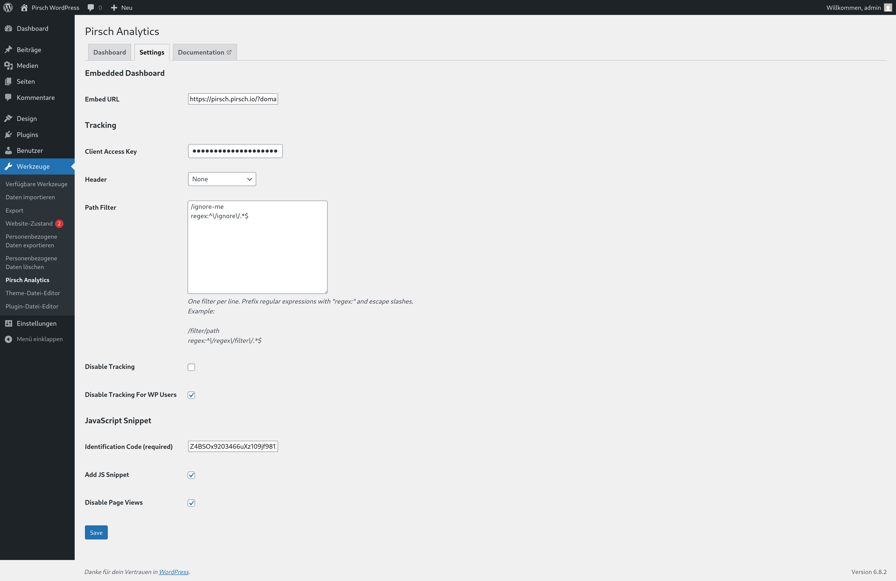

# WordPress

## Using the Plugin (Backend Integration)

[The plugin](https://wordpress.org/plugins/pirsch-analytics/#description) provides an easy way to integrate Pirsch into WordPress. It doesn't use JavaScript and works from your server. This is the [recommended approach](/get-started/backend-integration). You can still optionally add the JavaScript snippet to track custom events from your website.

To install the plugin, go to the Plugins page in your WordPress dashboard and click on **Install** next to the title. Search for "Pirsch Analytics" and click **Install** for the plugin.

Once installed, click **Activate** and navigate to **Tools** > **Pirsch Analytics** from the left hand menu. This will take you to the settings page.

Create and enter an access key for your dashboard. You can create new clients on the [integration settings page](/get-started/backend-integration#creating-a-client). After you click *Save*, Pirsch will start collecting statistics for your site.

There are a few optional fields you can configure to fine-tune the integration.

* An embed URL to display the dashboard in WordPress. You can create a private access link on the [access settings page](https://docs.pirsch.io/advanced/access)
* The header can be set to extract the IP address from if your server is behind a proxy or load balancer
* The path filter can be used to exclude pages using regular expressions. You need to enter one filter per line. A regular expression must start with the keyword `regex:`, like `regex:^\/filter\/.*$` for example
* Disable tracking disables the entire tracking on the page
* Disable tracking for WP users let's you exclude signed in users from the statistics
* The identification code is required if you would also like to add the JavaScript snippet. The code can be found on the [integration settings page](/get-started/backend-integration#creating-a-client)
* Add JS snippet will enable the snippet on your site
* Disable page views disables the script from collecting page views. **This must be set if you combine it with the access key, or otherwise page views will be duplicated**

## Permalink Settings

WordPress uses IDs to identify pages by default. This will show all pages on "/" or "/index.php" on the Pirsch dashboard, making it impossible to see which pages have actually been visited. We therefore recommend that you change the [permalink settings](https://wordpress.org/support/article/settings-permalinks-screen/).

1. Login to your WordPress dashboard
2. Go to settings -> permalinks from the left menu
3. Set something other than "simple" or define a custom structure

Another advantage of this is that your visitors will be able to recognise and find pages more easily.
