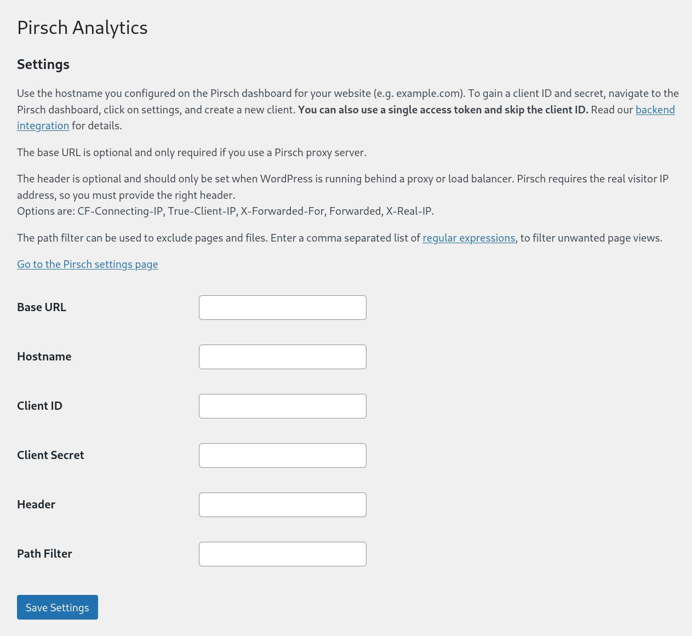

# WordPress

## Using the Plugin (Backend Integration)

[The plugin](https://wordpress.org/plugins/pirsch-analytics/#description) provides an easy way to integrate Pirsch into WordPress. It doesn't use JavaScript and works from your server. This is the [recommended approach](/get-started/backend-integration). For the script integration, see below.

> The plugin is triggered on each page visit. Some caching plugins might block it from being executed. If you don't receive traffic after installing and activating the Pirsch plugin, please try to disable your cache or switch to the JavaScript snippet.

To install the plugin, navigate to the plugins page on your WordPress administration dashboard and click on *Install* next to the title. Search for "Pirsch Analytics" and click on *Install* for the plugin. Once it is installed, click on *Activate* and navigate to *Tools* -> *Pirsch Analytics* from the left menu. This will open up the settings page.

Enter the hostname you used to set up the website on the Pirsch dashboard and the client ID and/or secret. You can create new clients on the [Settings page](/get-started/backend-integration#creating-a-client) for your website. We recommend using an *Access Token* instead of an oAuth client, as this won't make unneccessary roundtrips.

After you click *Save*, Pirsch will start collecting statistics for your website.

There are a few optional fields you can configure to fine-tune the integration.

* The base URL can be set if you use our [proxy](/get-started/proxy).
* The header can be set to extract the IP address from, if your server is behind a proxy or load balancer.
* The path filter can be used to exclude pages using regular expressions.

## Installing the Script (Frontend Integration)

To add the JavaScript snippet to your WordPress website, install the "Insert Headers and Footers" plugin. Navigate to the settings page of the plugin and paste the snippet inside the "header" section and save.

The snippet can be found on the settings page of your dashboard.

## Permalink Settings

WordPress uses IDs to identify pages by default. This will show all pages on "/" or "/index.php" on the Pirsch dashboard, making it impossible to see which pages were actually visited. Therefore, we recommend changing the [permalink settings](https://wordpress.org/support/article/settings-permalinks-screen/).

1. log into your WordPress dashboard
2. navigate to settings -> permalinks from the left menu
3. set something else than "plain" or define a custom structure

Another advantage of this is, that your visitors will more easily recognize pages and find them later.
