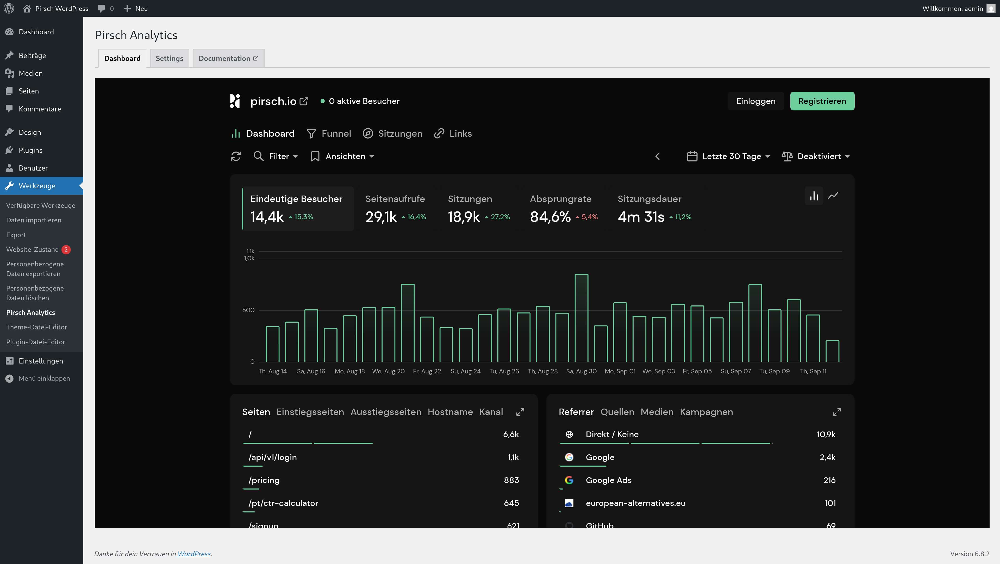

# WordPress

## Using the Plugin (Backend Integration)

[The plugin](https://wordpress.org/plugins/pirsch-analytics/#description) provides an easy way to integrate Pirsch into WordPress. It doesn't use JavaScript and works from your server. This is the [recommended approach](/get-started/backend-integration). For script integration, see below.

::: info
The plugin is triggered on every page visit. Some caching plugins may block it from running. If you don't receive traffic after installing and enabling the Pirsch plugin, please try disabling your cache or switching to the JavaScript snippet.
:::

To install the plugin, go to the Plugins page in your WordPress admin dashboard and click on **Install** next to the title. Search for "Pirsch Analytics" and click **Install** for the plugin. Once installed, click **Activate** and navigate to **Tools** -> **Pirsch Analytics** from the left hand menu. This will take you to the settings page.

Enter the hostname you used to set up the website on the Pirsch dashboard and the client ID and/or secret. You can create new clients for your website in the [Settings page](/get-started/backend-integration#creating-a-client). We recommend that you use an **Access Token** instead of an oAuth client, as this avoids unnecessary roundtrips.

After you click *Save*, Pirsch will start collecting statistics for your site.

There are a few optional fields you can configure to fine-tune the integration.

* The base URL can be set if you are using our [proxy](/advanced/proxy).
* The header can be set to extract the IP address from if your server is behind a proxy or load balancer.
* The path filter can be used to exclude pages using regular expressions.

## Installing the Script (Frontend Integration)

To add the JavaScript snippet to your WordPress website, install the Insert Headers and Footers plugin. Navigate to the settings page of the plugin and paste the snippet into the `<header>` section and save.

The snippet can be found on the Settings page of your dashboard.

## Permalink Settings

WordPress uses IDs to identify pages by default. This will show all pages on "/" or "/index.php" on the Pirsch dashboard, making it impossible to see which pages have actually been visited. We therefore recommend that you change the [permalink settings](https://wordpress.org/support/article/settings-permalinks-screen/).

1. Login to your WordPress dashboard
2. Go to settings -> permalinks from the left menu
3. Set something other than "simple" or define a custom structure

Another advantage of this is that your visitors will be able to recognise and find pages more easily.
